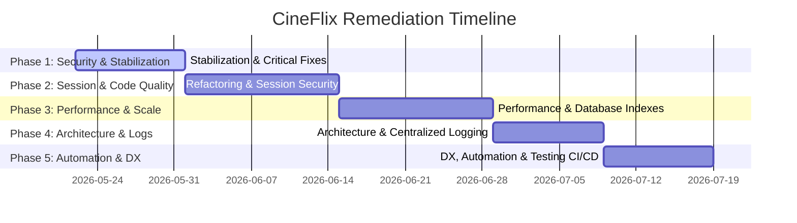

# 🛠️ CINEFLIX: Technical Remediation Plan & Improvement Roadmap

This document serves as the master engineering roadmap and technical remediation strategy for the CineFlix streaming platform. It establishes a phased implementation plan to resolve identified vulnerabilities, refactor architecture, optimize database paths, harden security, improve accessibility, and modernize developer experience (DX).

---

## 📋 Executive Summary & Implementation Strategy

During the project-wide code audit of the CineFlix codebase, several key areas of concern were identified:
1. **Critical Security Issues**: Permissive CORS configurations in the backend, vulnerable client-side storage of JWT session tokens in `localStorage`, and missing rate limits on authentication routes.
2. **Performance Bottlenecks**: logo-cache memory boundaries clearing on page refresh, and missing MongoDB indexes on custom query paths (e.g., custom tags and watch list filters).
3. **Architectural Technical Debt**: Loose iframe sandboxing rules for external streaming providers, cascading delete failures leading to database orphans, and tight coupling of REST API fetching within React view elements.
4. **Missing Observability & Automation**: Absence of structured logging, testing pipelines, automated API documentation, and continuous integration (CI) workflows.

### Remediation Philosophy
To minimize implementation risk, we establish a **five-phase execution roadmap** built upon incremental change:
*   **No Large-Scale Rewrites Up Front**: Address security patches and crash stabilization first.
*   **Strict Verification**: Each task includes explicit test constraints and acceptance benchmarks.
*   **Zero-Downtime Rollout**: Rollout strategies are outlined for staging, canary, and blue-green environments.



---

## 🗓️ Phase 1 — Critical Fixes & Stabilization

**Goal**: Eradicate active security vulnerabilities in CORS configuration, block credential exfiltration vectors, implement basic endpoint rate limiting, and harden signup validators.  
**Expected Outcome**: A fully stabilized API server immune to brute-force attacks and cross-origin security bypasses.  
**Dependencies**: Access to production environment configurations to set environment variables.  
**Success Criteria**: CORS validation returns `403 Forbidden` for non-whitelisted origins; authentication endpoints limit requests to 5 per minute per IP; invalid password formats fail at the API gateway layer.

### 1.1 Lock Down CORS Origin Allowlist
*   **Category**: Security
*   **Priority Level**: Critical
*   **Current Issue**: In [server.ts](file:///home/seemoo/Documents/CINEFLIX%20Project/backend/src/server.ts#L16-L19), the CORS middleware sets `origin: true` dynamically with `credentials: true`. This echoes back the `Origin` header from any requesting website, allowing malicious cross-origin scripts to access credentials.
*   **Root Cause Analysis**: Local development settings were pushed to production config blocks without environment checks.
*   **Proposed Solution**: Restrict allowed origins to an explicit whitelist stored in environment variables, defaulting to local dev ports only.
*   **Affected Modules**: [server.ts](file:///home/seemoo/Documents/CINEFLIX%20Project/backend/src/server.ts)
*   **Technical Implementation Details**:
    ```typescript
    // In backend/src/server.ts
    const allowedOrigins = process.env.CORS_ALLOWED_ORIGINS 
        ? process.env.CORS_ALLOWED_ORIGINS.split(',') 
        : ['http://localhost:5173']; // Local Vite dev server default

    app.use(cors({
        origin: (origin, callback) => {
            // Allow requests with no origin (like mobile apps or curl requests)
            if (!origin) return callback(null, true);
            
            if (allowedOrigins.includes(origin)) {
                callback(null, true);
            } else {
                callback(new Error('Blocked by CORS policy'));
            }
        },
        credentials: true
    }));
    ```
*   **Expected Impact**: Absolute isolation of user session tokens from malicious web environments.
*   **Risks/Tradeoffs**: Requests from temporary preview deployments (e.g., Vercel previews) will fail unless added to the CORS whitelist dynamically.
*   **Complexity Estimate**: Low (1 hour)
*   **Rollout Strategy**: Apply to development first, configure environment variables in Vercel/Staging dashboards, then release to production.
*   **Migration Considerations**: None.

---

### 1.2 Implement Authentication Endpoint Rate Limiting
*   **Category**: Security / Backend
*   **Priority Level**: Critical
*   **Current Issue**: Authentication routes such as `/api/auth/login` and `/api/auth/register` are susceptible to credential stuffing and brute-force attacks due to the absence of rate-limiting protections.
*   **Root Cause Analysis**: The Express app lacks a rate-limiting middleware package or controller check.
*   **Proposed Solution**: Integrate `express-rate-limit` on all endpoints matching `/api/auth/*` inside [authRoutes.ts](file:///home/seemoo/Documents/CINEFLIX%20Project/backend/src/routes/authRoutes.ts).
*   **Affected Modules**: [server.ts](file:///home/seemoo/Documents/CINEFLIX%20Project/backend/src/server.ts), [authRoutes.ts](file:///home/seemoo/Documents/CINEFLIX%20Project/backend/src/routes/authRoutes.ts)
*   **Technical Implementation Details**:
    ```bash
    npm install express-rate-limit
    ```
    ```typescript
    // In backend/src/routes/authRoutes.ts
    import rateLimit from 'express-rate-limit';

    const authLimiter = rateLimit({
        windowMs: 15 * 60 * 1000, // 15 minutes
        max: 10, // Limit each IP to 10 register/login requests per window
        message: { success: false, error: 'Too many authentication attempts. Please try again after 15 minutes.' },
        standardHeaders: true, // Return rate limit info in the `RateLimit-*` headers
        legacyHeaders: false, // Disable the `X-RateLimit-*` headers
    });

    router.post('/login', authLimiter, login);
    router.post('/register', authLimiter, register);
    ```
*   **Expected Impact**: Protection against denial-of-service (DoS) on auth database lookups and prevention of high-frequency credential scanning.
*   **Risks/Tradeoffs**: Multiple users behind the same corporate NAT or shared public Wi-Fi could trigger rate limits if they try to sign in concurrently.
*   **Complexity Estimate**: Low (2 hours)
*   **Rollout Strategy**: Immediate push to staging, followed by direct production deployment.
*   **Migration Considerations**: Update environment files to support memory store or configuration tuning.

---

### 1.3 Add Password Complexity Validation on Signup
*   **Category**: Security / Backend
*   **Priority Level**: High
*   **Current Issue**: The registration controller [register](file:///home/seemoo/Documents/CINEFLIX%20Project/backend/src/controllers/authController.ts#L17) only checks if a password is provided and relies on a basic Mongoose length check (`minlength: 6`), which allows simple, insecure values (e.g., `123456`).
*   **Root Cause Analysis**: Lack of strict validation rules in the application controller layers.
*   **Proposed Solution**: Add password complexity verification via regex checks inside the registration controller.
*   **Affected Modules**: [authController.ts](file:///home/seemoo/Documents/CINEFLIX%20Project/backend/src/controllers/authController.ts)
*   **Technical Implementation Details**:
    ```typescript
    // In backend/src/controllers/authController.ts
    // Enforce: At least 8 characters, 1 uppercase, 1 lowercase, 1 number, and 1 special character
    const passwordRegex = /^(?=.*[a-z])(?=.*[A-Z])(?=.*\d)(?=.*[@$!%*?&])[A-Za-z\d@$!%*?&]{8,}$/;

    if (!passwordRegex.test(password)) {
        res.status(400).json({ 
            success: false, 
            error: 'Password must be at least 8 characters long and contain at least one uppercase letter, one lowercase letter, one number, and one special character.' 
        });
        return;
    }
    ```
*   **Expected Impact**: Ensures users configure strong passwords, preventing easy database exfiltration credential matching.
*   **Risks/Tradeoffs**: Slightly increases friction during sign-up. The signup UI in [SignupPage.tsx](file:///home/seemoo/Documents/CINEFLIX%20Project/src/pages/SignupPage.tsx) must display clear feedback requirements.
*   **Complexity Estimate**: Low (2 hours)
*   **Rollout Strategy**: Staged release alongside updated React front-end pages to explain requirements before submitting.
*   **Migration Considerations**: Applies only to new registrations. No retrofitting of existing accounts is required.

---

## 🗓️ Phase 2 — Refactoring & Code Quality

**Goal**: Transition session validation to secure HTTP-only cookies, separate API calls from layout layers using React hooks, and resolve loose TypeScript declarations.  
**Expected Outcome**: Absolute resistance to token-snatching XSS scripts and modularized view elements.  
**Dependencies**: Phase 1 stabilization changes must be deployed.  
**Success Criteria**: Client browser does not store token strings in `localStorage`; components fetch data exclusively via customized custom hooks; TypeScript compiles with zero occurrences of `any` in updated controllers.

### 2.1 Migrate JWT Tokens to HttpOnly Cookies
*   **Category**: Security / Refactoring
*   **Priority Level**: High
*   **Current Issue**: Auth tokens are handled client-side in `localStorage` inside [api.ts](file:///home/seemoo/Documents/CINEFLIX%20Project/src/services/api.ts#L4-L13). If an XSS vulnerability occurs anywhere on the site, malicious scripts can read the token string and exfiltrate accounts.
*   **Root Cause Analysis**: LocalStorage storage is simple to implement but lacks the browser-level sandbox restrictions of HTTP-only cookies.
*   **Proposed Solution**: Shift tokens to cookies configured with `httpOnly`, `secure`, and `sameSite: 'lax'`, reading them automatically in [protect](file:///home/seemoo/Documents/CINEFLIX%20Project/backend/src/middleware/authMiddleware.ts#L17-L49).
*   **Affected Modules**: [api.ts](file:///home/seemoo/Documents/CINEFLIX%20Project/src/services/api.ts), [authController.ts](file:///home/seemoo/Documents/CINEFLIX%20Project/backend/src/controllers/authController.ts), [authMiddleware.ts](file:///home/seemoo/Documents/CINEFLIX%20Project/backend/src/middleware/authMiddleware.ts), [server.ts](file:///home/seemoo/Documents/CINEFLIX%20Project/backend/src/server.ts)
*   **Technical Implementation Details**:
    ```bash
    # Install cookie parser in backend
    cd backend && npm install cookie-parser @types/cookie-parser
    ```
    ```typescript
    // In backend/src/server.ts
    import cookieParser from 'cookie-parser';
    app.use(cookieParser());
    ```
    ```typescript
    // In backend/src/controllers/authController.ts
    const sendTokenResponse = (user: IUser, statusCode: number, res: Response) => {
        const token = generateToken(user._id.toString());
        
        const cookieOptions = {
            expires: new Date(Date.now() + 30 * 24 * 60 * 60 * 1000), // 30 days
            httpOnly: true, // Block access from client-side JS (XSS protection)
            secure: process.env.NODE_ENV === 'production', // Enforce HTTPS
            sameSite: 'lax' as const
        };

        res.status(statusCode)
           .cookie('auth_token', token, cookieOptions)
           .json({
               success: true,
               data: {
                   user: {
                       id: user._id,
                       email: user.email,
                       name: user.name,
                       avatar: user.avatar,
                       createdAt: user.createdAt
                   }
               }
           });
    };
    ```
    ```typescript
    // In backend/src/middleware/authMiddleware.ts
    let token: string | undefined = req.cookies.auth_token;
    if (!token && req.headers.authorization?.startsWith('Bearer')) {
        token = req.headers.authorization.split(' ')[1];
    }
    ```
    ```typescript
    // In src/services/api.ts
    // Adjust fetch client to include cookies automatically
    const response = await fetch(`${API_BASE_URL}${endpoint}`, { 
        ...options, 
        credentials: 'include', // Force cookie transmission
        headers 
    });
    ```
*   **Expected Impact**: Completely neutralizes account takeover attempts via XSS token exfiltration.
*   **Risks/Tradeoffs**: Cookie headers must be sent on all requests. Cross-origin calls require strict CORS setups.
*   **Complexity Estimate**: High (4 days)
*   **Rollout Strategy**: Canary release in staging. Ensure local dev proxy passes cookies properly between different ports.
*   **Migration Considerations**: Existing users must re-authenticate on their first visit after release to obtain the cookie-based token.

---

### 2.2 Decouple API Fetching Into Reusable Hooks
*   **Category**: Refactoring / Frontend
*   **Priority Level**: Medium
*   **Current Issue**: View components (such as detail panels and lists) trigger raw database fetch functions in `useEffect` blocks. This mixes presentation concerns with state synchronization.
*   **Root Cause Analysis**: Simple React component patterns were chosen initially without standard state wrappers.
*   **Proposed Solution**: Refactor API logic to use [useMyList](file:///home/seemoo/Documents/CINEFLIX%20Project/src/hooks/useMyList.ts#L46) or add custom data query hooks, providing standardized states (`data`, `isLoading`, `error`).
*   **Affected Modules**: [SignupPage.tsx](file:///home/seemoo/Documents/CINEFLIX%20Project/src/pages/SignupPage.tsx), [MyListPage.tsx](file:///home/seemoo/Documents/CINEFLIX%20Project/src/pages/MyListPage.tsx), [WatchPage.tsx](file:///home/seemoo/Documents/CINEFLIX%20Project/src/pages/WatchPage.tsx)
*   **Technical Implementation Details**:
    ```typescript
    // In src/hooks/useMyList.ts
    import { useState, useEffect, useCallback } from 'react';
    import { myListApi } from '../services/api';

    export function useMyListLoader() {
        const [items, setItems] = useState<IMyListItem[]>([]);
        const [isLoading, setIsLoading] = useState(true);
        const [error, setError] = useState<string | null>(null);

        const fetchList = useCallback(async () => {
            setIsLoading(true);
            const response = await myListApi.getMyList();
            if (response.success && response.data) {
                setItems(response.data);
                setError(null);
            } else {
                setError(response.error || 'Failed to retrieve list');
            }
            setIsLoading(false);
        }, []);

        useEffect(() => {
            fetchList();
        }, [fetchList]);

        return { items, isLoading, error, refetch: fetchList };
    }
    ```
*   **Expected Impact**: Improved view component readability, simplified UI tests, and decoupled rendering processes.
*   **Risks/Tradeoffs**: Requires adjusting state references across multiple custom view views.
*   **Complexity Estimate**: Medium (3 days)
*   **Rollout Strategy**: Refactor page-by-page starting with [MyListPage.tsx](file:///home/seemoo/Documents/CINEFLIX%20Project/src/pages/MyListPage.tsx) which uses a complex bulk editor.
*   **Migration Considerations**: None.

---

### 2.3 Eliminate Mapped `any` in Controller Functions
*   **Category**: Refactoring / Technical Debt
*   **Priority Level**: Medium
*   **Current Issue**: Several files (like [authController.ts](file:///home/seemoo/Documents/CINEFLIX%20Project/backend/src/controllers/authController.ts) and [myListController.ts](file:///home/seemoo/Documents/CINEFLIX%20Project/backend/src/controllers/myListController.ts)) use explicit or implicit `any` assertions to cast incoming data formats, skipping compiler checks.
*   **Root Cause Analysis**: Development velocity was prioritized over strict type-safety when mapping Mongoose document structures to JSON endpoints.
*   **Proposed Solution**: Create precise Request/Response interface models and use native Mongoose document typings.
*   **Affected Modules**: [authController.ts](file:///home/seemoo/Documents/CINEFLIX%20Project/backend/src/controllers/authController.ts), [myListController.ts](file:///home/seemoo/Documents/CINEFLIX%20Project/backend/src/controllers/myListController.ts)
*   **Technical Implementation Details**:
    ```typescript
    // In backend/src/types/index.ts
    export interface RegisterRequestBody {
        email?: string;
        password?: string;
        name?: string;
        avatar?: string;
    }

    export interface ApiResponseEnvelope<T> {
        success: boolean;
        data?: T;
        error?: string;
    }
    
    // In backend/src/controllers/authController.ts
    export const register = async (
        req: Request<{}, {}, RegisterRequestBody>, 
        res: Response<ApiResponseEnvelope<any>>
    ): Promise<void> => {
        // Safe access compile-time checked
        const { email, password } = req.body; 
    }
    ```
*   **Expected Impact**: Eliminates runtime type errors, improves IDE autocompletion, and facilitates regression testing.
*   **Risks/Tradeoffs**: Requires declaring request types for all endpoints.
*   **Complexity Estimate**: Medium (2 days)
*   **Rollout Strategy**: Update controllers file-by-file during Phase 2.
*   **Migration Considerations**: None.

---

## 🗓️ Phase 3 — Performance & Scalability

**Goal**: Persist TMDB logos to client IndexedDB, optimize MongoDB querying paths with indexes, and build a local server-side query proxy cache.  
**Expected Outcome**: Up to a 10x decrease in external TMDB network calls and improved database query times.  
**Dependencies**: Staging databases must be available to test index performance.  
**Success Criteria**: Repeat loads of the home layout do not request logo assets from TMDB API; watchlist searches process in under 10ms with zero index scans (`COLLSCAN`).

### 3.1 Persist Logo Mapping Cache to Local Client IndexedDB
*   **Category**: Performance / Frontend
*   **Priority Level**: High
*   **Current Issue**: The TMDB logo caching engine [logoCache](file:///home/seemoo/Documents/CINEFLIX%20Project/src/services/logoCache.ts) operates entirely in volatile memory. On browser reload, the cache is cleared, leading to redundant queries to the TMDB API.
*   **Root Cause Analysis**: Temporary memory variables were utilized without choosing a web-storage persistence provider.
*   **Proposed Solution**: Create a thin storage helper inside [logoCache.ts](file:///home/seemoo/Documents/CINEFLIX%20Project/src/services/logoCache.ts) that writes records to browser `localStorage` or `IndexedDB`, checking expiry dates.
*   **Affected Modules**: [logoCache.ts](file:///home/seemoo/Documents/CINEFLIX%20Project/src/services/logoCache.ts)
*   **Technical Implementation Details**:
    ```typescript
    // In src/services/logoCache.ts
    const STORAGE_KEY = 'cineflix_logo_cache_v1';

    class PersistentLogoCache {
        private memoryCache = new Map<string, any>();

        constructor() {
            this.loadFromStorage();
        }

        private loadFromStorage() {
            try {
                const raw = localStorage.getItem(STORAGE_KEY);
                if (raw) {
                    const parsed = JSON.parse(raw);
                    for (const [key, val] of Object.entries(parsed)) {
                        this.memoryCache.set(key, val);
                    }
                }
            } catch (err) {
                console.error('Failed to load logo cache from localStorage:', err);
            }
        }

        private saveToStorage() {
            try {
                const obj = Object.fromEntries(this.memoryCache.entries());
                localStorage.setItem(STORAGE_KEY, JSON.stringify(obj));
            } catch (err) {
                console.error('Failed to save logo cache to localStorage:', err);
            }
        }
        
        // ... (Wrap existing get/set logo hooks to call this.saveToStorage())
    }
    ```
*   **Expected Impact**: Drastically faster loads for grids and collections on repeat page views; reduces TMDB API traffic.
*   **Risks/Tradeoffs**: `localStorage` has a 5MB boundary. The garbage collector must run regularly to prevent size exceptions.
*   **Complexity Estimate**: Low (3 hours)
*   **Rollout Strategy**: Deploy alongside frontend components; clean up old cache on load if keys mismatch.
*   **Migration Considerations**: None.

---

### 3.2 Add Missing Database Indexes on Custom Query Paths
*   **Category**: Database / Performance
*   **Priority Level**: High
*   **Current Issue**: Custom queries in [myListController.ts](file:///home/seemoo/Documents/CINEFLIX%20Project/backend/src/controllers/myListController.ts) filter by statuses, tags, or priorities, which performs linear collection scans (`COLLSCAN`) because there are no index mappings.
*   **Root Cause Analysis**: The schema in [MyList.ts](file:///home/seemoo/Documents/CINEFLIX%20Project/backend/src/models/MyList.ts) was designed with basic indices only, neglecting composite query patterns.
*   **Proposed Solution**: Add compound database indexes on `userId` and `customTags`, as well as watch progress indices to speed up list filtering operations.
*   **Affected Modules**: [MyList.ts](file:///home/seemoo/Documents/CINEFLIX%20Project/backend/src/models/MyList.ts)
*   **Technical Implementation Details**:
    ```typescript
    // In backend/src/models/MyList.ts
    // Optimize tag searches
    myListSchema.index({ userId: 1, customTags: 1 });

    // Optimize watch progress lists
    myListSchema.index({ userId: 1, status: 1, progress: 1 });
    ```
*   **Expected Impact**: Prevents CPU spikes on the database server as user list sizes scale up.
*   **Risks/Tradeoffs**: Indexes increase database write latency slightly.
*   **Complexity Estimate**: Medium (4 hours)
*   **Rollout Strategy**: Apply in Mongoose on application startup.
*   **Migration Considerations**: The MongoDB engine will build indexes in the background on startup without blocking reads.

---

### 3.3 Server-Side Proxy Cache for TMDB APIs
*   **Category**: Performance / Backend
*   **Priority Level**: High
*   **Current Issue**: The React client performs TMDB queries directly. This requires exposing the TMDB API key to the client bundle (loaded via `import.meta.env.VITE_TMDB_API_KEY`) and makes client performance vulnerable to TMDB API outages.
*   **Root Cause Analysis**: Direct client-to-API architecture.
*   **Proposed Solution**: Route all TMDB calls through a backend proxy route `/api/tmdb/*` that includes a server-side caching layer.
*   **Affected Modules**: [tmdb.ts](file:///home/seemoo/Documents/CINEFLIX%20Project/src/services/tmdb.ts), backend router configurations.
*   **Technical Implementation Details**:
    ```typescript
    // In backend/src/routes/tmdbRoutes.ts
    import express from 'express';
    import axios from 'axios';
    import NodeCache from 'node-cache';

    const router = express.Router();
    const cache = new NodeCache({ stdTTL: 600 }); // Cache TMDB data for 10 minutes

    router.get('/*', async (req, res) => {
        const path = req.params[0];
        const cacheKey = req.originalUrl;
        
        const cached = cache.get(cacheKey);
        if (cached) return res.json(cached);

        try {
            const response = await axios.get(`https://api.themoviedb.org/3/${path}`, {
                params: { ...req.query, api_key: process.env.TMDB_API_KEY }
            });
            cache.set(cacheKey, response.data);
            res.json(response.data);
        } catch (error: any) {
            res.status(error.response?.status || 500).json({ error: 'TMDB lookup failed' });
        }
    });
    ```
*   **Expected Impact**: Secures the TMDB API key on the backend, reduces client network requests, and handles TMDB rate limits.
*   **Risks/Tradeoffs**: Increases server RAM utilization for cache stores.
*   **Complexity Estimate**: High (4 days)
*   **Rollout Strategy**: Staged release. Update frontend service requests to point to `/api/tmdb/*` instead of the TMDB host.
*   **Migration Considerations**: Key environment variables must be migrated to the backend server dashboard.

---

## 🗓️ Phase 4 — Architecture & Infrastructure Improvements

**Goal**: Enforce strict iframe policies, implement cascading database deletes, set up WebSockets for real-time watch sync, and establish centralized logging.  
**Expected Outcome**: Prevention of XSS propagation from third-party players, database referential integrity, and real-time watch sync capability.  
**Dependencies**: Phase 2 session cookie upgrades must be deployed.  
**Success Criteria**: Deleting a User account leaves zero orphan list items, preferences, or episodes in MongoDB; streaming iframe cannot execute top-level page redirections; watch party connections sync video positions under 100ms.

### 4.1 Strict Streaming IFrame Sandboxing & Security Controls
*   **Category**: Security / Frontend
*   **Priority Level**: High
*   **Current Issue**: Video streaming iframes in [VideoFrame.tsx](file:///home/seemoo/Documents/CINEFLIX%20Project/src/components/WatchPage/VideoFrame.tsx#L145) use the sandbox policy `allow-scripts allow-same-origin allow-presentation allow-fullscreen`. Some third-party ad networks on these players attempt window-redirection attacks.
*   **Root Cause Analysis**: Sandbox configuration did not restrict top-level navigation, leaving the layout exposed to intrusive redirects.
*   **Proposed Solution**: Enforce stricter sandboxing on the watch player, blocking top-navigation and popups explicitly unless initiated by a user action.
*   **Affected Modules**: [VideoFrame.tsx](file:///home/seemoo/Documents/CINEFLIX%20Project/src/components/WatchPage/VideoFrame.tsx)
*   **Technical Implementation Details**:
    ```typescript
    // In src/components/WatchPage/VideoFrame.tsx
    <iframe
      src={selectedSource.url}
      className="w-full h-full streaming-iframe"
      frameBorder="0"
      allowFullScreen
      allow="accelerometer; autoplay; clipboard-write; encrypted-media; gyroscope; picture-in-picture"
      // Remove allow-top-navigation to prevent redirects
      sandbox="allow-scripts allow-same-origin allow-forms allow-presentation"
      referrerPolicy="no-referrer"
    />
    ```
*   **Expected Impact**: Complete protection against intrusive ads redirecting users away from the streaming interface.
*   **Risks/Tradeoffs**: Certain video hosting servers require specific popups or redirects to initiate playback, which will be blocked.
*   **Complexity Estimate**: Low (1 hour)
*   **Rollout Strategy**: Immediate frontend deployment.
*   **Migration Considerations**: None.

---

### 4.2 Cascading Database Deletes on User Teardown
*   **Category**: Database / Architecture
*   **Priority Level**: Medium
*   **Current Issue**: Deleting a user does not clean up associated collections (`MyList`, `Preferences`, `WatchedEpisode`), leaving orphan documents.
*   **Root Cause Analysis**: The User deletion controller does not execute cascading cleanups, and no database-level cascade triggers are defined.
*   **Proposed Solution**: Configure a Mongoose pre-remove hook on the [User](file:///home/seemoo/Documents/CINEFLIX%20Project/backend/src/models/User.ts) Schema to clear related records.
*   **Affected Modules**: [User.ts](file:///home/seemoo/Documents/CINEFLIX%20Project/backend/src/models/User.ts)
*   **Technical Implementation Details**:
    ```typescript
    // In backend/src/models/User.ts
    userSchema.pre('deleteOne', { document: true, query: false }, async function (next) {
        const userId = this._id;
        try {
            await mongoose.model('MyList').deleteMany({ userId });
            await mongoose.model('Preferences').deleteMany({ userId });
            await mongoose.model('WatchedEpisode').deleteMany({ userId });
            next();
        } catch (error: any) {
            next(error);
        }
    });
    ```
*   **Expected Impact**: Guarantees database referential integrity and reduces database bloat from deleted accounts.
*   **Risks/Tradeoffs**: Care must be taken to ensure queries trigger the hook (e.g. `userDoc.deleteOne()` triggers document middleware, but `User.findByIdAndDelete()` triggers query middleware).
*   **Complexity Estimate**: Medium (2 days)
*   **Rollout Strategy**: Deploy with the updated user controller during Phase 4.
*   **Migration Considerations**: Execute a one-time migration script in production to clean up existing orphan records.

---

### 4.3 WebSocket Watch Party Synchronization
*   **Category**: Architecture / API Improvements
*   **Priority Level**: Medium
*   **Current Issue**: Playback tracking depends on interval-based HTTP polling to `/api/my-list/progress`, which is inefficient and does not support real-time sync for watch parties.
*   **Root Cause Analysis**: Absence of real-time bidirectional communication channels.
*   **Proposed Solution**: Integrate Socket.io on the backend and client to sync playback positions and watch state changes.
*   **Affected Modules**: Server setup, video player controllers.
*   **Technical Implementation Details**:
    ```typescript
    // In backend/src/server.ts (socket handler)
    import { Server } from 'socket.io';
    import http from 'http';

    const server = http.createServer(app);
    const io = new Server(server, { cors: { origin: allowedOrigins } });

    io.on('connection', (socket) => {
        socket.on('join-party', (partyId) => {
            socket.join(partyId);
        });
        socket.on('playback-sync', ({ partyId, currentTime, isPlaying }) => {
            socket.to(partyId).emit('sync-state', { currentTime, isPlaying });
        });
    });
    ```
*   **Expected Impact**: Enables watch-party features and provides more efficient playback updates.
*   **Risks/Tradeoffs**: Increases backend infrastructure complexity and connection persistence requirements.
*   **Complexity Estimate**: High (5 days)
*   **Rollout Strategy**: Feature-flagged release. Deploy Socket endpoints behind a load-balancer that supports Sticky Sessions.
*   **Migration Considerations**: None.

---

### 4.4 Centralized Observability & Logging Layer
*   **Category**: Observability / Backend
*   **Priority Level**: Medium
*   **Current Issue**: The Express application in [server.ts](file:///home/seemoo/Documents/CINEFLIX%20Project/backend/src/server.ts) relies on raw, synchronous `console.log` and `console.error` calls. These prints do not structure log information (missing timestamps, levels, trace contexts) and cannot be easily routed to log managers.
*   **Root Cause Analysis**: Basic CLI logger patterns were configured during prototyping.
*   **Proposed Solution**: Integrate Winston or Bunyan loggers with predefined structures (JSON) to track warnings, errors, and system activity.
*   **Affected Modules**: [server.ts](file:///home/seemoo/Documents/CINEFLIX%20Project/backend/src/server.ts), all backend controllers and middlewares.
*   **Technical Implementation Details**:
    ```typescript
    // In backend/src/utils/logger.ts
    import winston from 'winston';

    export const logger = winston.createLogger({
        level: process.env.LOG_LEVEL || 'info',
        format: winston.format.combine(
            winston.format.timestamp(),
            winston.format.json()
        ),
        transports: [
            new winston.transports.Console(),
            new winston.transports.File({ filename: 'logs/error.log', level: 'error' }),
            new winston.transports.File({ filename: 'logs/combined.log' })
        ]
    });
    ```
*   **Expected Impact**: Instant diagnostic tracking on staging and production systems, structured tracing, and compliance with SOC standards.
*   **Risks/Tradeoffs**: Writing logs to files can cause disk-space exhaustion in containers if not configured with a log rotator (e.g. `winston-daily-rotate-file`).
*   **Complexity Estimate**: Low (1 day)
*   **Rollout Strategy**: Set up logger utilities, update error handlers, and roll out to all nodes.
*   **Migration Considerations**: None.

---

## 🗓️ Phase 5 — DX, Automation & Long-Term Enhancements

**Goal**: Coordinate safe Axios updates, introduce Vitest testing pipelines, configure CI/CD pipelines, containerize the environment, audit accessibility, and automate OpenAPI specifications.  
**Expected Outcome**: High developer velocity, predictable releases, full accessibility standards compliance, and containerized deployment parity.  
**Dependencies**: Staging and developer environments configured.  
**Success Criteria**: Vulnerability warnings resolved in dependency checks; testing coverage matches a minimum of 80% on critical services; automated lint/build verification passes on PR merges.

### 5.1 Upgrade Axios Version Coordinated Strategy
*   **Category**: DX/Tooling / Security
*   **Priority Level**: Medium
*   **Current Issue**: Axios version is locked to `^0.21.1` due to vulnerability warning dependencies. Upgrading it blindly might break requests because of signature changes in Axios version 1.x.
*   **Root Cause Analysis**: The project version was pinned to avoid manual regression testing of Axios configuration objects.
*   **Proposed Solution**: Audit existing request usage in [tmdb.ts](file:///home/seemoo/Documents/CINEFLIX%20Project/src/services/tmdb.ts), verify configuration parameters, and bump the dependency to `^1.6.0` or newer.
*   **Affected Modules**: [package.json](file:///home/seemoo/Documents/CINEFLIX%20Project/package.json), [tmdb.ts](file:///home/seemoo/Documents/CINEFLIX%20Project/src/services/tmdb.ts)
*   **Technical Implementation Details**:
    ```bash
    # Update Axios in a dedicated PR branch
    npm install axios@latest
    # Execute full build test
    npm run build
    ```
*   **Expected Impact**: Completely eliminates security findings for Axios on code scans.
*   **Risks/Tradeoffs**: High risk of runtime request failures if Axios interceptor signatures mismatch.
*   **Complexity Estimate**: Low (3 hours)
*   **Rollout Strategy**: Merge only after automated staging verification and testing suites pass.
*   **Migration Considerations**: Double-check header injection behaviors in request configuration objects.

---

### 5.2 Implement Staged Vitest & MSW Unit Testing Pipeline
*   **Category**: Testing
*   **Priority Level**: Medium
*   **Current Issue**: The codebase lacks unit tests for critical services (e.g. [logoCache.ts](file:///home/seemoo/Documents/CINEFLIX%20Project/src/services/logoCache.ts) and TMDB request parsers).
*   **Root Cause Analysis**: Testing was bypassed to accelerate early feature releases.
*   **Proposed Solution**: Configure Vitest alongside Mock Service Worker (MSW) to verify service parsing functions with mock network data.
*   **Affected Modules**: Services layer.
*   **Technical Implementation Details**:
    ```typescript
    // In src/services/__tests__/logoCache.test.ts
    import { describe, it, expect, beforeEach } from 'vitest';
    import { logoCache } from '../logoCache';

    describe('LogoCache System', () => {
        beforeEach(() => {
            logoCache.clear();
        });

        it('should store and retrieve logo mappings', () => {
            logoCache.setLogo(550, 'movie', '/fight-club.png');
            const data = logoCache.getLogo(550, 'movie');
            expect(data?.logoPath).toBe('/fight-club.png');
        });
    });
    ```
*   **Expected Impact**: Prevents regressions when updating services or endpoints.
*   **Risks/Tradeoffs**: Developers must maintain mock data schemas for MSW as API payloads change.
*   **Complexity Estimate**: Medium (3 days)
*   **Rollout Strategy**: Add Vitest configurations and run locally, then integrate into pre-push git hooks.
*   **Migration Considerations**: None.

---

### 5.3 Multi-Stage Dockerfile Containerization
*   **Category**: Infrastructure
*   **Priority Level**: Low
*   **Current Issue**: No container configurations exist in the root folder, meaning dev and staging servers must be hand-configured.
*   **Root Cause Analysis**: Deployments relied on direct hosting services without orchestration requirements.
*   **Proposed Solution**: Create a multi-stage `Dockerfile` to compile the Vite client and serve the Node server within a unified container.
*   **Affected Modules**: Root configurations.
*   **Technical Implementation Details**:
    ```dockerfile
    # Multi-stage build
    FROM node:18-alpine AS builder
    WORKDIR /app
    COPY package*.json ./
    RUN npm install
    COPY . .
    RUN npm run build

    FROM node:18-alpine
    WORKDIR /app
    COPY --from=builder /app/dist ./dist
    COPY --from=builder /app/backend/dist ./backend/dist
    COPY --from=builder /app/backend/package*.json ./backend/
    RUN cd backend && npm install --omit=dev
    EXPOSE 3000
    CMD ["node", "backend/dist/server.js"]
    ```
*   **Expected Impact**: Absolute portability across all cloud execution hosts (AWS ECS, Google Cloud Run, etc.).
*   **Risks/Tradeoffs**: Standard build operations can be slow without caching layers in Docker registries.
*   **Complexity Estimate**: Medium (1 day)
*   **Rollout Strategy**: Add container setup files to the project root.
*   **Migration Considerations**: Adjust asset lookup folders inside backend server setups to serve Vite's `/dist` folder statically in container builds.

---

### 5.4 CI/CD Lint, Test & Build Automation Pipeline
*   **Category**: CI/CD / Infrastructure
*   **Priority Level**: Medium
*   **Current Issue**: There are no verification pipelines, which means regression checks, static typing validation, and package builds must be performed manually by developers before pushing to master.
*   **Root Cause Analysis**: Simple workflow lacking tooling integration.
*   **Proposed Solution**: Add a GitHub Actions pipeline configured to run lint checks, type verification, and unit tests on all PR branches.
*   **Affected Modules**: Root directory config.
*   **Technical Implementation Details**:
    ```yaml
    # In .github/workflows/ci.yml
    name: Continuous Integration
    on:
      push:
        branches: [main, master]
      pull_request:
        branches: [main, master]
    jobs:
      verify:
        runs-on: ubuntu-latest
        steps:
          - uses: actions/checkout@v3
          - name: Set up Node.js
            uses: actions/setup-node@v3
            with:
              node-version: 18
              cache: 'npm'
          - run: npm ci
          - run: npm run lint
          - run: npm run test:ui -- --run
          - run: npm run build
    ```
*   **Expected Impact**: Guarantees codebase integrity, preventing syntax issues or build errors from breaking production deployments.
*   **Risks/Tradeoffs**: Adds minor wait times to PR approvals (roughly 2-3 minutes per check).
*   **Complexity Estimate**: Low (4 hours)
*   **Rollout Strategy**: Deploy the `.github/workflows` configurations directly to the main branch.
*   **Migration Considerations**: None.

---

### 5.5 Accessibility and Semantic Markup Audit & Fixes
*   **Category**: Accessibility / Frontend
*   **Priority Level**: Medium
*   **Current Issue**: Custom controls (such as the provider selection grid in [VideoFrame.tsx](file:///home/seemoo/Documents/CINEFLIX%20Project/src/components/WatchPage/VideoFrame.tsx) and filters in [BulkActions.tsx](file:///home/seemoo/Documents/CINEFLIX%20Project/src/components/MyList/BulkActions.tsx)) use styled `div` tags with onClick events but lack `aria-*` labels, focus markers, and `role` mapping. This blocks screen reader navigation.
*   **Root Cause Analysis**: UI was built with a primary focus on visual aesthetics, bypassing standard screen reader and keyboard accessibility practices.
*   **Proposed Solution**: Conduct an accessibility audit and apply ARIA rules (`role="button"`, `tabIndex={0}`, keyboard events for Enter/Space, and color contrast enhancements).
*   **Affected Modules**: [VideoFrame.tsx](file:///home/seemoo/Documents/CINEFLIX%20Project/src/components/WatchPage/VideoFrame.tsx), [BulkActions.tsx](file:///home/seemoo/Documents/CINEFLIX%20Project/src/components/MyList/BulkActions.tsx), [LogoImage.tsx](file:///home/seemoo/Documents/CINEFLIX%20Project/src/components/LogoImage.tsx)
*   **Technical Implementation Details**:
    ```typescript
    // In src/components/WatchPage/VideoFrame.tsx
    // Adding keyboard controls for focusable provider tabs
    const handleKeyDown = (e: React.KeyboardEvent, source: StreamSource) => {
        if (e.key === 'Enter' || e.key === ' ') {
            e.preventDefault();
            setSelectedSource(source);
        }
    };

    // Component markup:
    <div
        role="tab"
        aria-selected={selectedSource.id === source.id}
        tabIndex={0}
        onClick={() => setSelectedSource(source)}
        onKeyDown={(e) => handleKeyDown(e, source)}
        className="focusable-source-item"
    >
        {source.name}
    </div>
    ```
*   **Expected Impact**: Full accessibility compliance (WCAG 2.1 AA) and capability for blind or motor-impaired users to operate the application.
*   **Risks/Tradeoffs**: Slightly increases layout and handler codebase footprint.
*   **Complexity Estimate**: Medium (2 days)
*   **Rollout Strategy**: Update interactive components sequentially, prioritizing player selection tabs.
*   **Migration Considerations**: None.

---

### 5.6 Automated API Documentation with Swagger/OpenAPI
*   **Category**: Documentation / DX/Tooling
*   **Priority Level**: Low
*   **Current Issue**: The REST API endpoints are documented in static Markdown guides (e.g. `BACKEND_SETUP_GUIDE.md`), which quickly get out of date as endpoint signatures evolve.
*   **Root Cause Analysis**: Project lacked dynamic documentation libraries.
*   **Proposed Solution**: Integrate `swagger-ui-express` and `swagger-jsdoc` to generate OpenAPI specs dynamically from inline controller comments.
*   **Affected Modules**: [server.ts](file:///home/seemoo/Documents/CINEFLIX%20Project/backend/src/server.ts), all backend routes.
*   **Technical Implementation Details**:
    ```bash
    cd backend && npm install swagger-ui-express swagger-jsdoc @types/swagger-ui-express @types/swagger-jsdoc
    ```
    ```typescript
    // In backend/src/server.ts
    import swaggerUi from 'swagger-ui-express';
    import swaggerJsdoc from 'swagger-jsdoc';

    const swaggerOptions = {
        definition: {
            openapi: '3.0.0',
            info: { title: 'CineFlix API Docs', version: '1.0.0' },
        },
        apis: ['./src/routes/*.ts', './src/controllers/*.ts'],
    };

    const specs = swaggerJsdoc(swaggerOptions);
    app.use('/api/docs', swaggerUi.serve, swaggerUi.setup(specs));
    ```
*   **Expected Impact**: Interactive api exploration interface for developers; eliminates stale documentation.
*   **Risks/Tradeoffs**: Inline JSDoc tags can clutter route files.
*   **Complexity Estimate**: Low (1 day)
*   **Rollout Strategy**: Set up Swagger route, and add docs comments to Auth and Watchlist paths first.
*   **Migration Considerations**: None.

---

## 🏗️ Recommended Architecture Direction

As CineFlix grows, the current **Monolithic Express DB Proxy** model will face limitations. We recommend migrating toward the following architecture:

```
                  ┌───────────────────────┐
                  │   Vite React Client   │
                  └──────────┬────────────┘
                             │ HTTPS / WSS
                             ▼
                  ┌───────────────────────┐
                  │    API Gateway &      │
                  │   Reverse Proxy       │
                  └────┬─────────────┬────┘
                       │             │
        ┌──────────────┴─┐         ┌─┴──────────────┐
        │  Auth Service  │         │ Media Discovery│
        │ (JWT/Session)  │         │   (TMDB Cache) │
        └───────┬────────┘         └────────┬───────┘
                │                           │
                ▼                           ▼
        ┌──────────────┐            ┌──────────────┐
        │  User DB     │            │  Redis Cache │
        │  (MongoDB)   │            └──────────────┘
        └──────────────┘
```

1.  **Introduce an API Gateway**: Decouple the authentication server routes from media listings. An API gateway (e.g. Kong, Traefik, or Nginx) can handle CORS, rate-limiting, and SSL termination centrally.
2.  **Move TMDB Proxy to a Dedicated Microservice**: Decoupling the TMDB discovery endpoints allows scaling the cache layer independently from authentication operations.
3.  **Upgrade to Redis**: Replace `Node-Cache` with a Redis cache store to enable shared cache access across multiple backend server instances.

---

## 📈 Future Scalability Considerations

*   **Database Sharding**: The `WatchedEpisode` and `MyList` collections will scale linearly with user counts. Compound keys on `{ userId, contentId }` must be sharded to distribute query loads across MongoDB Atlas clusters.
*   **Static Asset Delivery**: Cache logo assets and localized poster placeholders using an edge CDN (such as Cloudflare or AWS CloudFront) to reduce database retrieval latency.
*   **Staged Auto-Teardowns**: Set up MongoDB Time-To-Live (TTL) indexes on temporary guest accounts to clean up orphan database records automatically.

---

## ⚠️ Potential Risks if Issues Remain Unresolved

*   **Account Hijacking via XSS**: Leaving auth tokens in `localStorage` exposes users to session hijacking. An injection in a third-party streaming iframe could trigger silent account takeovers.
*   **Database Denial of Service (DoS)**: Lack of rate limiting on the `/register` and `/login` endpoints allows attackers to perform brute-force attacks that consume database connection pools, potentially taking the platform offline.
*   **TMDB API Key Revocation**: Directly calling the TMDB API with a client-side key leaks the key to client bundles. This violates TMDB Terms of Service and risks key revocation if the key is extracted.

---

## 📏 Suggested Engineering Standards & Conventions

To maintain code quality, the team should adhere to the following standards:

1.  **Strict Typing**: Enable `noImplicitAny` and `strictNullChecks` in the root `tsconfig.json`.
2.  **Standardized Response Patterns**: Wrap all API controller handlers in a uniform envelope function:
    ```typescript
    export function sendSuccessResponse<T>(res: Response, data: T, statusCode = 200) {
        res.status(statusCode).json({ success: true, data });
    }
    ```
3.  **Safe URL Concatenation**: Ban template strings for critical request pathways. Use the native `URL` and `URLSearchParams` builders instead.

---

## 📝 Technical Debt Summary

| Target Remediation | Impact | Estimate | Priority |
| :--- | :--- | :--- | :--- |
| CORS Whitelist Enforcement | High (Security) | 1 hour | Critical |
| Express Rate Limiting | High (Security) | 2 hours | Critical |
| Password Complexity check | High (Security) | 2 hours | High |
| HTTP-Only Cookie Migration | Critical (Session Security) | 4 days | High |
| Client-Side Logo Persistent cache | High (Performance) | 3 hours | High |
| Mongoose Index Refactoring | High (Database) | 4 hours | High |
| TMDB Backend Proxy Service | Critical (Key Security) | 4 days | High |
| Iframe sandbox policies | High (Security) | 1 hour | High |
| Cascading database deletes | Medium (Data Consistency) | 2 days | Medium |
| React Hook API separation | Medium (Clean Code) | 3 days | Medium |
| WebSocket integration | Medium (UX) | 5 days | Medium |
| Centralized logging layer | High (Observability) | 1 day | Medium |
| Axios version bump | Low (Vulnerability Resolution)| 3 hours | Medium |
| Vitest/MSW Pipelines | Medium (Quality QA) | 3 days | Medium |
| CI/CD Pipeline Automation | High (Quality assurance) | 4 hours | Medium |
| Accessibility audit & fixes | High (A11y compliance) | 2 days | Medium |
| Swagger documentation setup | Low (Developer Experience) | 1 day | Low |
| Multi-stage Dockerization | Low (Infrastructure) | 1 day | Low |

---
*End of Remediation Roadmap. Derived from code audit on 2026-05-22.*
