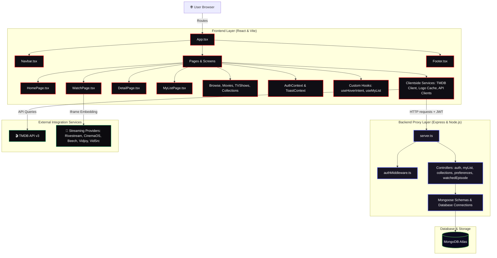

# 🎬 CINEFLIX: Full-Stack MERN Streaming Platform - Deep Technical Analysis

CineFlix is a production-grade, full-stack media discovery and streaming application modeled after premium interfaces. This document presents a comprehensive analysis of the system architecture, custom subsystems, data flows, database schemas, security posture, and code quality benchmarks.

---

## 🏗️ 1. High-Level Architecture & Component Map

CineFlix is structured as a decoupled client-server application consisting of a React-Vite-TypeScript frontend and a Node-Express-TypeScript backend database proxy.

### Visual Architecture Diagram



### Core Frontend Routing Map

The client router is defined in [App.tsx](file:///home/seemoo/Documents/CINEFLIX%20Project/src/App.tsx) and organizes routes into three distinct access levels:

| Route Path | Component | Access Level | Primary Feature |
| :--- | :--- | :--- | :--- |
| `/` | [HomePage.tsx](file:///home/seemoo/Documents/CINEFLIX%20Project/src/pages/HomePage.tsx) | Public | Featured carousel, content categories, signup promo bubble |
| `/movies` | [Movies.tsx](file:///home/seemoo/Documents/CINEFLIX%20Project/src/pages/Movies.tsx) | Public | Filtered movie listing with category selectors |
| `/tv-shows` | [TVShows.tsx](file:///home/seemoo/Documents/CINEFLIX%20Project/src/pages/TVShows.tsx) | Public | TV Series index and genre browsing |
| `/browse` | [BrowsePage.tsx](file:///home/seemoo/Documents/CINEFLIX%20Project/src/pages/BrowsePage.tsx) | Public | Aggregated scroll grid of movie and TV categories |
| `/new-popular` | [NewPopularPage.tsx](file:///home/seemoo/Documents/CINEFLIX%20Project/src/pages/NewPopularPage.tsx) | Public | Trending & recently-added listings with custom styling |
| `/collections` | [CollectionsPage.tsx](file:///home/seemoo/Documents/CINEFLIX%20Project/src/pages/CollectionsPage.tsx) | Public | Infinite-scroll discovery grid of 6,400+ TMDB franchises |
| `/collection/:id` | [CollectionDetailPage.tsx](file:///home/seemoo/Documents/CINEFLIX%20Project/src/pages/CollectionDetailPage.tsx) | Public | Staggered timelines, stats, and complete lists of movies in a saga |
| `/movie/:id` | [DetailPage.tsx](file:///home/seemoo/Documents/CINEFLIX%20Project/src/pages/DetailPage.tsx) | Public | Dynamic backdrop hero, trailer modal, crew scroll, episodes, reviews |
| `/tv/:id` | [DetailPage.tsx](file:///home/seemoo/Documents/CINEFLIX%20Project/src/pages/DetailPage.tsx) | Public | TV specific details, seasons switcher, cast grid |
| `/watch/movie/:id` | [WatchPage.tsx](file:///home/seemoo/Documents/CINEFLIX%20Project/src/pages/WatchPage.tsx) | Public | Embedded multi-server video player, ratings, downloads |
| `/watch/tv/:id` | [WatchPage.tsx](file:///home/seemoo/Documents/CINEFLIX%20Project/src/pages/WatchPage.tsx) | Public | Season/episode selector, episode progression, dynamic streaming embeds |
| `/search` | [SearchPage.tsx](file:///home/seemoo/Documents/CINEFLIX%20Project/src/pages/SearchPage.tsx) | Public | Search query results for movies, TV series, actors, and directors |
| `/login` | [LoginPage.tsx](file:///home/seemoo/Documents/CINEFLIX%20Project/src/pages/LoginPage.tsx) | Unauthenticated | Login screen with validation, secure JWT retrieval |
| `/signup` | [SignupPage.tsx](file:///home/seemoo/Documents/CINEFLIX%20Project/src/pages/SignupPage.tsx) | Unauthenticated | Multi-avatar signup page with password complexity check |
| `/my-list` | [MyListPage.tsx](file:///home/seemoo/Documents/CINEFLIX%20Project/src/pages/MyListPage.tsx) | Protected | User's MongoDB-persisted watchlist with filters, search, and bulk edits |
| `/account` | [AccountPage.tsx](file:///home/seemoo/Documents/CINEFLIX%20Project/src/pages/AccountPage.tsx) | Protected | Comprehensive settings portal: passwords, privacy, language, region |

---

## 🗄️ 2. Database Schema Analysis

The backend data models are implemented using TypeScript and Mongoose, enforcing typing on documents and fields.

### User Schema (`users` collection)
Defined in [User.ts](file:///home/seemoo/Documents/CINEFLIX%20Project/backend/src/models/User.ts), it holds core credentials and metadata:
- `email` (String, unique, lowercase, trimmed, validated via regex): Serves as unique username identifier.
- `password` (String, write-only/selected-false by default): Salted and hashed using `bcryptjs` with 12 rounds on pre-save hooks.
- `name` (String, required): Display name of the user (2+ characters).
- `avatar` (String): URL/Base64 of the selected user profile icon.

### Watchlist Schema (`mylist` collection)
Defined in [MyList.ts](file:///home/seemoo/Documents/CINEFLIX%20Project/backend/src/models/MyList.ts), this stores rich watch state details for each piece of media. Mongoose indexing is defined across `userId`, `contentId`, `contentType` for absolute uniqueness per user list item:
- `userId` (Mongoose ObjectId, ref: 'User', indexed): Owner of the list item.
- `contentId` (Number, required): TMDB database reference ID.
- `contentType` (String, enum: `['movie', 'tv']`): Category of media.
- `content` (Mixed Object, required): Cached core metadata payload of the movie or TV show (title, posters, release date, backdrop).
- `status` (String, enum: `['notStarted', 'inProgress', 'completed', 'dropped']`): Tracked watch status.
- `progress` (Number, min 0, max 100): Percentage tracking of completion.
- `playbackPosition` / `duration` (Number): Playback session location in seconds.
- `lastEpisode` (Sub-document): Holds `{ seasonNumber, episodeNumber }` for TV progress persistence.
- `priority` (String, enum: `['high', 'medium', 'low']`): Watch priority tag.
- `customTags` (Array of Strings): Customized tagging system for categorization.
- `isLiked` (Boolean): User feedback flag, mapping to recommendations.

### Preferences Schema (`preferences` collection)
Defined in [Preferences.ts](file:///home/seemoo/Documents/CINEFLIX%20Project/backend/src/models/Preferences.ts), this document isolates settings from user metadata:
- `userId` (Mongoose ObjectId, ref: 'User', unique): Maps 1-to-1 with a user.
- **View Configuration**: modes (`grid`/`list`/`compact`), sort criteria (`dateAdded`, `title`, `rating`), auto-remove toggles.
- **Playback Setup**: Video qualities (`auto`, `4k`, `1080p`), autoplay controls, default audio/subtitle languages, and wifi limitations.
- **Privacy & A11y**: Visibility of viewing history/profile, GDPR data collection agreements, high-contrast, reduced motion flags, and interface base font sizes.
- **Localization**: Preferred app interface languages, geographical regions, and regional time zones.

---

## 🔌 3. Custom Systems & Features Architecture

### A. Smart Hover Intent Detection System

To prevent aggressive popup renders during vertical scrolls (either via trackpad scroll or fast mouse wheels), CineFlix uses a global scroll-aware interaction listener and custom delays.

1. **Global Interaction Tracker** ([interactionTracker.ts](file:///home/seemoo/Documents/CINEFLIX%20Project/src/lib/interactionTracker.ts)):
   Maintains a global singleton recording the timestamps of the last mouse pointer movements and scroll events. It maps document-level event listeners for `pointermove` and `wheel` with `{ passive: true }` to maximize scroll performance.
2. **Hover Intent Hook** ([useHoverIntent.ts](file:///home/seemoo/Documents/CINEFLIX%20Project/src/hooks/useHoverIntent.ts)):
   Translates pointer actions to logical intents. It computes the delta between pointer and scroll timestamps.
   - If a mouse entry occurs within `wheelThreshold` (250ms) of a scroll event without coordinate delta, it is recognized as scroll-induced and blocked.
   - Genuine movement schedules the hover state change via a timeout (`hoverDelay` of 180ms).
   - If keyboard navigation triggers an element focus event (`onFocus`), the hover state is immediately set to active, bypassing delay checks for full screen-reader and tab navigation support.

### B. TMDB Official Logo Caching System

To simulate a premium streaming site experience, text titles in grids/heros are dynamically replaced by SVG/PNG logos from TMDB's `images` endpoint.

```
Request Details Logo for ID
           │
           ▼
┌────────────────────────────────────┐
│ Check memory Cache (logoCache.ts)   │
└──────────────────┬─────────────────┘
                   │
         [Found & Valid <24h] ?
         /                   \
      [Yes]                  [No]
       /                       \
      ▼                         ▼
Return Path             Query TMDB API
                   (Preload/Batch dynamic)
                                │
                      [Successful Lookup] ?
                      /                   \
                   [Yes]                  [No]
                    /                       \
                   ▼                         ▼
            Save Path to Cache       Mark Logo Failed in Cache
            (Exp. in 24 hours)       (Block redundant retry requests)
```

1. **Logo Image Resolver Component** ([LogoImage.tsx](file:///home/seemoo/Documents/CINEFLIX%20Project/src/components/LogoImage.tsx)):
   Handles image loading states and fallback logic. When `logoPath` is absent or triggers an error, it degrades to a styled text heading using Tailwind shadows and text size settings. It uses the custom `.logo-glow` transition class on load.
2. **Logo Cache Service** ([logoCache.ts](file:///home/seemoo/Documents/CINEFLIX%20Project/src/services/logoCache.ts)):
   Maintains a memory map for retrieved logos. Features:
   - **Time-to-Live**: 24-hour expiration check for cached assets.
   - **Garbage Collection**: Limits cache sizes to 1,000 entries. Expired files are dropped. If still over capacity, the oldest 20% of entries are sorted and deleted.
   - **Failed Attempt Tracker**: If an asset fails to fetch, it is cached with a `failed: true` flag, preventing subsequent useless API requests for the same media ID.
   - **Batch Loading**: Exposes `preloadLogos` to scan lists of cards and fetch multiple logos sequentially in chunks of 5, separated by 100ms pauses to avoid hitting API rate limits.

### C. Multi-Provider Video Streaming Integration

CineFlix routes TMDB queries to live video providers in [WatchPage.tsx](file:///home/seemoo/Documents/CINEFLIX%20Project/src/pages/WatchPage.tsx), using iframe components in [VideoFrame.tsx](file:///home/seemoo/Documents/CINEFLIX%20Project/src/components/WatchPage/VideoFrame.tsx).

- **Rivestream Core**: Exposes standard embeds, aggregated server matrices, and torrent fallback routes.
- **CinemaOS**: Built with a deep blue accent theme. Automatically appends `/season/episode` structures for TV series.
- **Beech API & Vidjoy API**: Serve as fast CDN backups using distinct CSS color-coding (green/purple) for user-friendly diagnostics.
- **VidSrc Matrix**: Configured with four separate API pathways:
  1. API 1: Multi-server distribution.
  2. API 2: Regional/Multi-language content pools.
  3. API 3: Combined multi-embed interface.
  4. API 4: Premium/Ad-free streaming lines.
- **VidFast API**: Dedicated lightweight endpoints with auto-play parameters set.

### D. Advanced Watchlist & Bulk Edit Systems

The watchlist has been extended beyond a simple gallery into an active data table, with states handled in [MyListPage.tsx](file:///home/seemoo/Documents/CINEFLIX%20Project/src/pages/MyListPage.tsx):

- **View Options**: Layout switchers toggle between card grids ([GridView.tsx](file:///home/seemoo/Documents/CINEFLIX%20Project/src/components/MyList/GridView.tsx)), structured list lines ([ListView.tsx](file:///home/seemoo/Documents/CINEFLIX%20Project/src/components/MyList/ListView.tsx)), and space-saving tables ([CompactView.tsx](file:///home/seemoo/Documents/CINEFLIX%20Project/src/components/MyList/CompactView.tsx)).
- **Bulk Actions**: Batch selectors in [BulkActions.tsx](file:///home/seemoo/Documents/CINEFLIX%20Project/src/components/MyList/BulkActions.tsx) allow users to apply status tags (`completed`, `inProgress`), assign custom keywords, change priority ratings, or delete selected rows in a single API operation.
- **Import/Export Utility**: Renders an interactive modal ([ExportModal.tsx](file:///home/seemoo/Documents/CINEFLIX%20Project/src/components/MyList/ExportModal.tsx)) to serialize lists into JSON strings or CSV tables for offline backups, or upload external config payloads.
- **Analytics Panel**: [StatsModal.tsx](file:///home/seemoo/Documents/CINEFLIX%20Project/src/components/MyList/StatsModal.tsx) uses the stored database values (such as `estimatedRuntime` and completion percentages) to display stats on total viewing time, genre distribution, completion rates, and average personal ratings.

---

## 🔒 4. Security & Vulnerability Audit

### Axios Vulnerability Analysis (CWE-20 Input Validation)
As documented in the root [package.json](file:///home/seemoo/Documents/CINEFLIX%20Project/package.json), the current repository locks `axios` to version `0.21.1` (which is vulnerable to input validation flaws, SSRF, and request header injection issues). 

> [!WARNING]
> DO NOT manually alter the version in `package.json` until a formal staging deployment is scheduled. 
> To safeguard the current build, all parameters, query arguments, and host boundaries passed to axios client hooks must be filtered, sanitized, and type-checked before executing requests.

### Client-to-Backend Security Architecture
1. **JWT Verification**:
   The Express backend intercepts queries using [authMiddleware.ts](file:///home/seemoo/Documents/CINEFLIX%20Project/backend/src/middleware/authMiddleware.ts). The authorization header is verified against the `JWT_SECRET` key, decrypting user IDs to assign them to `req.user`.
2. **Password Storing security**:
   The user database schema leverages a pre-save hook that hashes passwords with `bcryptjs` using a salt work factor of 12. Password values are marked `select: false` within database schemas to prevent them from being returned in standard user lookup queries.

---

## 📐 5. Code Quality & Standards Compliance

An audit of the source files shows strong alignment with modern frontend guidelines:

- **Strict Types**: The files in `src/types/` define structures for `Movie`, `TVShow`, `Collection`, and `MyListItem`. They avoid the use of `any` (except for database payloads mapped under mongoose schema mixins).
- **Early Returns Pattern**: Components and controller routes systematically execute guard checks at the start (e.g. validating authentications or checking inputs), keeping the primary execution path clean and readable.
- **Aesthetic Styling**: The app uses Tailwind CSS, dark overlays (`#141414`), responsive layouts, and Framer Motion transitions (for card expansion, carousel scrolling, and navigation fades).
- **Accessibility features (a11y)**: Focus indicators, labels on form fields, keydown hooks for keyboard navigation, and semantic tags (such as `header`, `nav`, and `main`) are configured throughout the app.

---

## 🎯 6. Key Opportunities & Next Steps

Based on our analysis, the following areas can be targeted for future improvement:

1. **Implement Axios Request Sanitizer**: Create a global Axios wrapper that validates request parameters, preventing potential exploitation of the older Axios version.
2. **Refresh Token Lifecycle**: Transition from a single long-lived JWT in `localStorage` to a dual-token setup: short-lived access tokens (15 mins) and secure `httpOnly` refresh tokens stored in cookies.
3. **Database Caching Layer**: Add a Redis cache in the backend server for frequently accessed TMDB requests, reducing external network latency.
4. **WebSocket Syncing**: Integrate Socket.io on the watch page to support real-time sync for watch parties and instant playback progress updates.

---
*Created as a structural project reference. All directories are linked. Use the absolute file links above for direct file access.*
