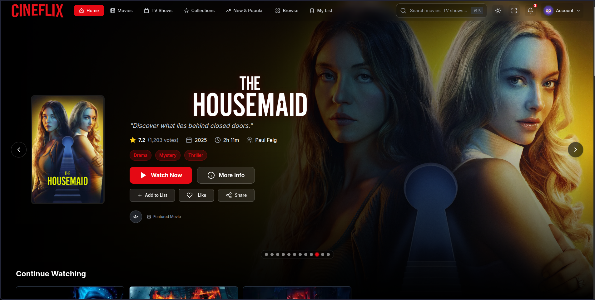
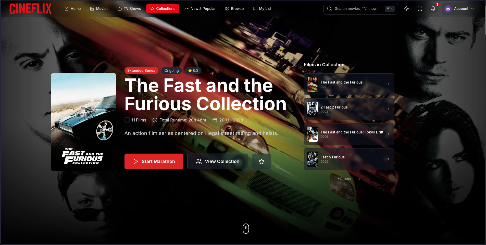
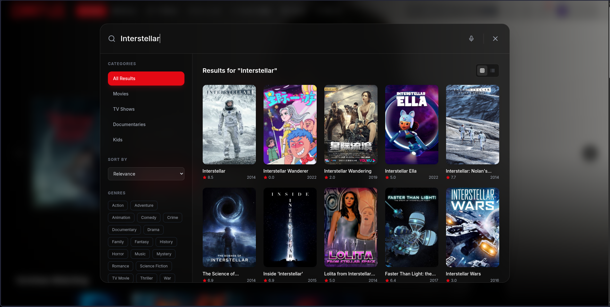
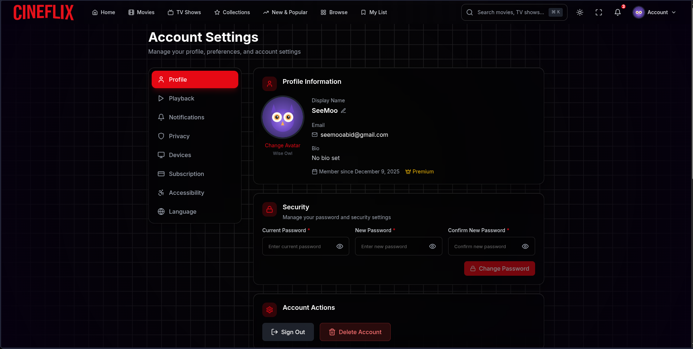
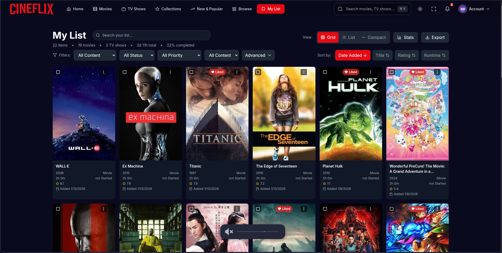
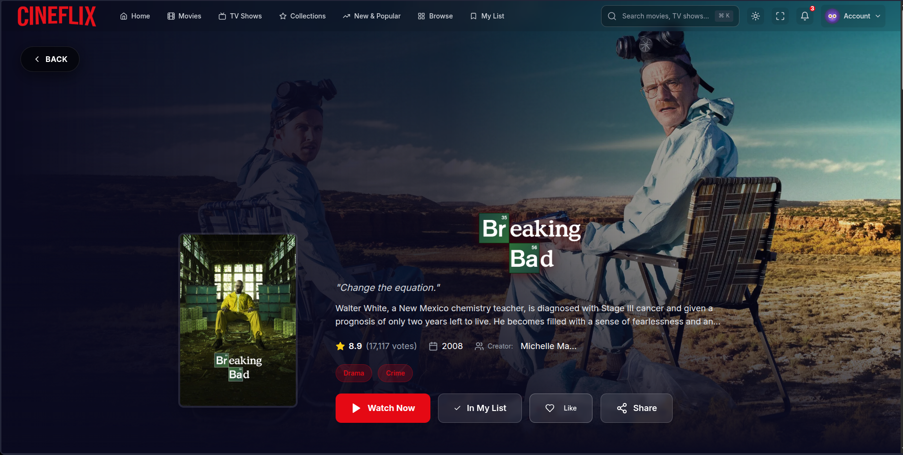

<div align="center">

<!-- Wave Header -->


<!-- Official Logo -->
<br/>

<br/>
<sub><strong>Full-Stack MERN Streaming & Discovery Platform</strong></sub>
<br/><br/>

<!-- Dynamic Typing SVG -->
<a href="#">
  
</a>

<br/>

<!-- Badges Row 1 -->
[](https://react.dev/)
[](https://www.typescriptlang.org/)
[](https://vitejs.dev/)
[](https://tailwindcss.com/)

<!-- Badges Row 2 -->
[](https://expressjs.com/)
[](https://www.mongodb.com/)
[](https://socket.io/)
[](https://www.themoviedb.org/)

<!-- Badges Row 3 -->
[](LICENSE)
[](CONTRIBUTING.md)

<br/>

[**🌐 cineflix.dev**](https://cineflix.dev)

<br/>

<!-- Quick Preview Banner -->
<table>
<tr>
<td align="center"><strong>🏠 Home</strong></td>
<td align="center"><strong>🎬 Collections</strong></td>
<td align="center"><strong>🔍 Search</strong></td>
</tr>
<tr>
<td></td>
<td></td>
<td></td>
</tr>
<tr>
<td align="center"><strong>🎥 Detail</strong></td>
<td align="center"><strong>📋 My List</strong></td>
<td align="center"><strong>▶️ Watch</strong></td>
</tr>
<tr>
<td></td>
<td></td>
<td></td>
</tr>
</table>


</div>

---

##  &nbsp;About The Project

**CINEFLIX** is a production-grade streaming and discovery platform built from the ground up with the **MERN stack** (MongoDB, Express, React, Node.js) and an end-to-end **TypeScript** codebase. It delivers a premium, Netflix-inspired experience — from cinematic hero carousels and hover preview cards to a full authentication system, real-time watch parties, and a **50+ provider streaming engine** with native HLS playback.

> 🎯 **Well beyond a clone** — CINEFLIX has grown into a mature platform featuring smart collection discovery with 6,400+ TMDB franchises, a dual-mode streaming player (classic iframe + native HLS via CinePro), real-time watch parties over Socket.io, Google OAuth, httpOnly cookie sessions, server-side API proxying, structured logging, PWA installability, internationalization, and a security-hardened backend with SSRF protection, rate limiting, and CSP headers.

<details>
<summary><strong>🤔 Why CINEFLIX?</strong></summary>

<br/>

| Problem | CINEFLIX Solution |
|---------|------------------|
| 🎭 Generic streaming UIs | Premium dark theme with glassmorphism, gradients & Framer Motion micro-interactions |
| 📚 No collection browsing | Infinite scroll discovery of **6,400+** TMDB franchises with timelines |
| 🔐 Weak/insecure auth | JWT over httpOnly cookies + Google OAuth, bcrypt (cost 12), rate limiting |
| 👥 Watching alone | **Watch Parties** — synced playback + live chat over WebSockets |
| ▶️ Single fragile source | **50+ streaming providers** with automatic fallback + native HLS player |
| 🔑 Exposed API keys | Server-side TMDB/OMDb proxy with caching — keys never reach the browser |
| 📋 Can't track anything | My List, favorites, continue-watching, per-episode progress, stats |
| 🌍 English only | i18n support via `i18next` / `react-i18next` |
| 📶 Needs a browser tab | **PWA** — installable with `vite-plugin-pwa` + Workbox service worker |

</details>

---

## ✨ Features

<div align="center">

```
┌─────────────────────────────────────────────────────────────────┐
│                        🎬 CINEFLIX WEB                          │
├─────────────────────────────────────────────────────────────────┤
│                                                                 │
│  🏠 DISCOVER            │  📚 COLLECTIONS      │  🔍 SEARCH    │
│  ├─ Hero Carousel       │  ├─ Infinite Scroll  │  ├─ Fuzzy     │
│  ├─ Hover Preview Cards │  ├─ Genre Filters    │  ├─ Multi-type│
│  ├─ Category Rows       │  ├─ Franchise Detail │  └─ Keyboard  │
│  ├─ Dynamic Backgrounds │  └─ Timeline View    │     Shortcuts │
│  └─ Content Carousels   │                      │               │
│                         │                      │               │
│  ▶️ SMART PLAYER │  👥 WATCH PARTIES │  📋 MY LIST  │  👤 AUTH   │
│  ├─ Native HLS   │  ├─ Create/Join   │  ├─ Watchlist│  ├─ Email │
│  ├─ 50+ Providers│  ├─ Synced Play   │  ├─ Favorites│  ├─ Google│
│  ├─ Subtitle     │  ├─ Live Chat     │  ├─ Continue │  ├─ Cookie│
│  ├─ Quality Pick │  └─ Host Control  │  ├─ Stats    │  │  Only  │
│  └─ Iframe       │                   │  └─ Episodes │  └─ Secure│
│     Fallback     │                   │              │           │
│                                                                 │
│  🔒 SECURITY      │  🌍 PLATFORM       │  📊 TRACKING          │
│  ├─ SSRF Guard     │  ├─ PWA Install    │  ├─ Marathon Progress │
│  ├─ Helmet CSP     │  ├─ i18n Ready     │  ├─ Episode Watched  │
│  ├─ Rate Limiting  │  ├─ SEO Meta Tags  │  ├─ Completion Stats │
│  └─ API Key Proxy  │  └─ Docker Ready   │  └─ Continue Watch   │
│                                                                 │
└─────────────────────────────────────────────────────────────────┘
```

</div>

### 🏠 Discovery & Browse
- **Cinematic hero carousel** with auto-rotation, backdrop images, and logo overlays
- **Hover preview cards** with intent detection, trailers, and quick actions
- **Category carousels** — Trending, Popular, Top Rated, Now Playing, Upcoming
- **Dedicated pages** — Movies, TV Shows, New & Popular, Browse
- **Dynamic backgrounds** with animated gradient effects
- **Sign-up promo bubble** for unauthenticated users
- **Responsive design** — Desktop, tablet, and mobile layouts

### 📚 Collections — *Star Feature*
- **Infinite scroll discovery** of **6,400+** TMDB movie collections
- **Genre-based filtering** — Action, Sci-Fi, Fantasy, Horror, Animation, and more
- **Collection detail pages** with franchise timelines and film lists
- **Hero section** with featured collections and stats
- **Progress tracking** across film franchises

### 🔍 Search
- **Multi-type search** — Movies, TV Shows, and People in one query
- **Fuzzy ranking** with Fuse.js for intelligent matching
- **Command-style search modal** with keyboard shortcuts
- **Real-time, debounced results** with intelligent ranking

### ▶️ Watch Experience — *Dual Player Modes*
- **Smart / Native Player** — In-app **HLS playback** via `hls.js` with the CinePro/P-Stream adapter, quality selection, subtitle support (`subsrt-ts`, `wyzie-lib`), and automatic iframe fallback
- **Classic Player** — Sandboxed iframe embeds for legacy providers
- **50+ streaming providers** built into a modular provider engine with automatic fallback — including RiveStream, SmashyStream, 111movies, Vidjoy, VidSrc, VidRock, CatFlix, ZoeChip, Nunflix, and many more
- **Provider engine** with scraper architecture, captioning, quality normalization, and proxy support
- **OMDb ratings** integration (server-side proxied) for IMDb scores alongside TMDB data
- **Heuristic watch-progress tracking** persisted to MongoDB + localStorage

### 👥 Watch Parties — *Real-Time*
- **Create or join** a party by ID; the creator becomes **host**
- **Synced playback** (play/pause/seek) broadcast to all members over Socket.io
- **Live party chat** with message sanitization
- **Automatic host migration** when the host leaves; room auto-teardown when empty
- **WebSocket authentication** — party events require a valid JWT cookie

### 📋 My List & Tracking
- **Watchlist + favorites**, persisted to MongoDB and user-scoped
- **Continue Watching** with heuristic resume points
- **Per-episode watched tracking** for TV shows with season progress
- **Filtering** — All, Movies, TV Shows, by status, recently added
- **Personal ratings, notes, tags, priority**, and bulk operations
- **Aggregate stats** — totals, hours watched, completion rate, distributions
- **Hover preview** with quick actions

### 👤 Accounts & Auth
- **Email/password sign up + login** with strong password policy (min 8 characters)
- **Google OAuth** (ID token & access token flows with audience + `email_verified` verification)
- **JWT over httpOnly cookies** (30-day expiry) — no localStorage tokens
- **Account page** — change password, update profile name/avatar, logout
- **Password-reset flow** — request + reset endpoints (email delivery stubbed)
- **Protected routes** — Watch, My List, Account, Collections, Preferences require auth

### 🌍 Platform
- **PWA** — installable with `vite-plugin-pwa` + Workbox service worker caching
- **i18n** support via `i18next` / `react-i18next` with locale resources
- **SEO** — dynamic meta tags via `react-helmet-async`
- **Docker** — multi-stage Dockerfile with production-optimized runtime
- **Gamepad support** — controller navigation via `useGamepad` hook
- **Smooth scrolling** via `lenis`, toast notifications, error boundaries
- **Swagger API docs** at `/api/docs` (development mode only)

---

## 🎨 Design System

<div align="center">

| Token | Value | Usage |
|-------|-------|-------|
| 🌙 **Background** | `#141414` | Netflix dark — all screens |
| 🔴 **Accent** | `#E50914` | CTAs, active states, branding |
| 🟣 **Dark Purple** | `#0f0e14` | Deep sections |
| 🔵 **Purple Blue** | `#181524` | Card overlays |
| 📝 **Text Primary** | `#FFFFFF` | Headers, titles |
| 📝 **Text Secondary** | `#B3B3B3` | Body text, descriptions |
| 📝 **Text Muted** | `#808080` | Hints, labels |

</div>

> **Design Philosophy:** Cinematic dark theme inspired by premium streaming platforms with glassmorphism cards, Framer Motion animations, and smooth gradient transitions across every component.

---

## 🛠️ Tech Stack

<div align="center">

<!-- Skill Icons -->
<a href="https://skillicons.dev">
  
</a>

<br/><br/>

</div>

### Frontend

| Layer | Technology | Purpose |
|-------|-----------|---------|
| **UI / Language** | React 18, TypeScript 5 | Component-based UI with full type safety |
| **Build Tool** | Vite 8 | Fast HMR & optimized production bundling |
| **Styling** | Tailwind CSS 3.4, `tailwind-merge`, `clsx` | Utility-first CSS with merge utilities |
| **Animations** | Framer Motion 12, React Spring | Premium micro-interactions & transitions |
| **State** | Zustand 5, Immer | Lightweight global state (player, auth, preferences, subtitles, quality, overlays) |
| **Routing** | React Router 6 | Client-side routing with lazy loading |
| **Data / HTTP** | Axios, `ofetch` | API communication with interceptors |
| **Streaming** | `hls.js`, `hls-parser`, `subsrt-ts`, `wyzie-lib` | Native HLS playback, subtitle parsing, caption support |
| **Realtime** | `socket.io-client` | Watch party sync & live chat |
| **Search** | Fuse.js | Client-side fuzzy search ranking |
| **i18n** | i18next, react-i18next | Internationalization framework |
| **SEO** | react-helmet-async | Dynamic meta tags per page |
| **PWA** | vite-plugin-pwa, Workbox | Installable app with service worker caching |
| **Security** | DOMPurify, crypto-js | Input sanitization & client-side crypto |
| **Icons** | Lucide React, react-icons | Consistent SVG icon sets |

### Backend

| Layer | Technology | Purpose |
|-------|-----------|---------|
| **Runtime / Framework** | Node.js 18+, Express 4 | REST API server with middleware pipeline |
| **Database / ODM** | MongoDB (Atlas) 8, Mongoose 8 | User data, lists, preferences, episodes |
| **Auth** | JWT (`jsonwebtoken`), bcryptjs, cookie-parser | httpOnly cookie sessions, password hashing |
| **Realtime** | Socket.io 4 | Watch party rooms, playback sync, chat |
| **Security** | Helmet, express-rate-limit, SSRF guard | CSP, HSTS, rate limiting, private-IP blocking |
| **Caching** | node-cache | Server-side TMDB/OMDb response caching |
| **Logging** | Winston + daily-rotate-file | Structured JSON logging with rotation |
| **API Docs** | swagger-jsdoc + swagger-ui-express | Interactive Swagger UI at `/api/docs` |
| **API Proxy** | TMDB, OMDb, Vidrock routes | Server-side key injection — keys never reach client |

### Provider Engine

| Layer | Purpose |
|-------|---------|
| **50+ Source Providers** | Modular scraper architecture under `src/lib/providers/engine/` |
| **CinePro Adapter** | Bridge to CinePro Core for native HLS streams |
| **Quality Normalization** | Standardizes quality labels across providers |
| **Caption System** | Cross-provider subtitle extraction and formatting |
| **Proxy Utilities** | Stream/playlist URL rewriting through backend proxies |

### Testing & Tooling

| Purpose | Technology |
|---------|-----------|
| **Unit / Component** | Vitest, Testing Library, jsdom |
| **Coverage** | `@vitest/coverage-v8` |
| **Linting** | ESLint, `@typescript-eslint` |
| **Dev Orchestration** | concurrently (frontend + backend together) |

### External Services

| Service | Purpose |
|---------|---------|
| **TMDB API v3** | Movies, TV shows, people, images, search (proxied server-side) |
| **OMDb API** | IMDb ratings and metadata (proxied server-side) |
| **Google OAuth** | Social sign-in (ID token + access token flows) |
| **50+ Streaming Providers** | Video sources with automatic fallback |
| **CinePro Core** | Optional companion service for native HLS streams |

---

## 🏛️ Architecture

<div align="center">

```
┌──────────────────────────────────────────────────────────────────┐
│                          BROWSER (PWA)                           │
│  React 18 + TS · Zustand · Router · hls.js player · socket.io   │
└───────────────┬───────────────────────────────────┬──────────────┘
                │ REST (/api, credentials: cookie)  │ WebSocket
                ▼                                    ▼
┌──────────────────────────────────────────────────────────────────┐
│                    EXPRESS API (port 3001)                        │
│  /api/auth  ── email/pass + Google OAuth · JWT httpOnly cookie   │
│  /api/my-list · /api/collections · /api/preferences              │
│  /api/watched-episodes                                           │
│  /api/tmdb ──────── server-side TMDB proxy (node-cache, 10m TTL) │
│  /api/omdb ──────── server-side OMDb proxy (7-day cache)         │
│  /api/vidrock ───── server-side Vidrock encryption                │
│  /api/proxy · /api/media-proxy ── stream / HLS playlist rewrite  │
│  /api/docs ──────── Swagger UI (dev only) · /health              │
│  Middleware: Helmet · CORS · cookie-parser · rate-limit · Winston │
│  Socket.io: watch-party rooms, playback sync, chat, host migrate │
└───────────────┬───────────────────────────────────┬──────────────┘
                │ Mongoose                           │ fetch
                ▼                                    ▼
        ┌───────────────┐                   ┌──────────────────┐
        │  MongoDB Atlas │                   │  TMDB / OMDb /   │
        │  users, lists, │                   │  Streaming       │
        │  prefs, watched│                   │  providers       │
        └───────────────┘                   └──────────────────┘
```

</div>

---

## 📁 Project Architecture

```
cineflix/
├── 📱 src/                                  # Frontend source (React + TypeScript)
│   ├── App.tsx                             # Root component, routes, providers
│   ├── main.tsx                            # Entry point
│   │
│   ├── 📄 pages/                           # Route pages (17 pages)
│   │   ├── HomePage.tsx                    # 🏠 Landing + hero carousel
│   │   ├── BrowsePage.tsx                  # 🎭 Browse content
│   │   ├── Movies.tsx                      # 🎬 Movies category
│   │   ├── TVShows.tsx                     # 📺 TV Shows category
│   │   ├── NewPopularPage.tsx              # 🔥 New & Popular
│   │   ├── CollectionsPage.tsx             # 📚 Collection discovery
│   │   ├── CollectionDetailPage.tsx        # 📚 Franchise detail + timeline
│   │   ├── DetailPage.tsx                  # 🎥 Movie/TV detail
│   │   ├── SearchPage.tsx                  # 🔍 Search results
│   │   ├── WatchPage.tsx                   # ▶️ Classic iframe player
│   │   ├── SmartPlayerPage.tsx             # ▶️ Native HLS player
│   │   ├── WatchRedirect.tsx               # ▶️ Player mode router
│   │   ├── MyListPage.tsx                  # 📋 User watchlist
│   │   ├── ContinueWatchingPage.tsx        # ⏩ Resume watching
│   │   ├── AccountPage.tsx                 # 👤 Profile & settings
│   │   ├── LoginPage.tsx                   # 🔐 Sign in
│   │   └── SignupPage.tsx                  # 📝 Register
│   │
│   ├── 🧩 components/                      # 50+ reusable UI components
│   │   ├── Navbar.tsx                      # Navigation bar
│   │   ├── Footer.tsx                      # Site footer
│   │   ├── HeroCarousel.tsx                # Auto-rotating hero
│   │   ├── ContentCarousel.tsx             # Category row carousel
│   │   ├── ContentCard.tsx / MovieCard.tsx  # Content cards
│   │   ├── HoverPreviewCard.tsx            # Hover intent preview
│   │   ├── FranchiseCard.tsx               # Collection card
│   │   ├── CollectionsHero.tsx             # Collections hero section
│   │   ├── CollectionsFilter.tsx           # Genre filter bar
│   │   ├── GenreCollections.tsx            # Genre browsing grid
│   │   ├── TimelineView.tsx                # Franchise timeline
│   │   ├── EnhancedSearch.tsx              # Search component
│   │   ├── SearchModal.tsx                 # Search overlay
│   │   ├── SmartPlayerModal.tsx            # Player mode selector
│   │   ├── WatchPage/                      # Watch experience components
│   │   │   ├── NativePlayerSection.tsx     # HLS native player
│   │   │   ├── StreamSources.tsx           # Provider source list
│   │   │   ├── SeasonsEpisodesSection.tsx  # TV episode navigation
│   │   │   ├── UserRating.tsx              # Personal rating widget
│   │   │   ├── SimilarContent.tsx          # Recommendations
│   │   │   └── VideoFrame.tsx              # Iframe embed wrapper
│   │   ├── player/                         # Player controls & overlays
│   │   ├── overlays/                       # Modal overlays
│   │   ├── feedback/                       # EmptyState, ErrorState, LoadingScreen
│   │   ├── auth/                           # Auth-related components
│   │   ├── ProtectedRoute.tsx              # Auth guard
│   │   ├── ErrorBoundary.tsx               # Error handling
│   │   └── ...                             # 20+ more components
│   │
│   ├── 🎮 lib/providers/engine/            # Streaming provider engine
│   │   ├── index.ts                        # Engine entry point
│   │   ├── providers/
│   │   │   ├── all.ts                      # Provider registry
│   │   │   ├── base.ts                     # Base provider interface
│   │   │   ├── streams.ts / captions.ts    # Stream & caption types
│   │   │   └── sources/                    # 50+ provider scrapers
│   │   │       ├── vidrock.ts / catflix.ts / zoechip.ts / nunflix.ts ...
│   │   │       ├── ridomovies/ / lookmovie/ / soapertv/ / warezcdn/ ...
│   │   │       └── ... (35 files + 15 directories)
│   │   └── utils/                          # Proxy, quality, TMDB, playlist utils
│   │
│   ├── ⚙️ services/                        # API & business logic
│   │   ├── tmdb.ts                         # TMDB service (via server proxy)
│   │   ├── omdb.ts                         # OMDb ratings (via server proxy)
│   │   ├── api.ts                          # Backend API client (cookie auth)
│   │   ├── collectionsService.ts           # Collection tracking
│   │   ├── collectionDiscovery.ts          # Collection discovery engine
│   │   ├── myListService.ts                # Watchlist management
│   │   ├── watchService.ts                 # Watch history & progress
│   │   ├── progressService.ts              # Progress tracking
│   │   ├── rivestreamService.ts            # RiveStream provider
│   │   ├── smashystream.ts                 # SmashyStream provider
│   │   ├── 111movies.ts                    # 111movies provider
│   │   ├── cinepro-adapter/                # CinePro Core bridge
│   │   ├── logoCache.ts                    # Image cache layer
│   │   └── analytics.ts                    # Page tracking
│   │
│   ├── 🏪 stores/                          # Zustand state stores
│   │   ├── auth/                           # Authentication state
│   │   ├── player/                         # Player state (slices, utils)
│   │   ├── progress/                       # Watch progress
│   │   ├── subtitles/                      # Subtitle preferences
│   │   ├── quality/                        # Quality selection
│   │   ├── volume/                         # Volume state
│   │   ├── preferences/                    # User preferences
│   │   ├── language/                       # i18n language
│   │   ├── bookmarks/                      # Bookmarked content
│   │   ├── banner/                         # Banner state
│   │   ├── interface/                      # UI state
│   │   ├── overlay/                        # Overlay state
│   │   ├── cinepro/                        # CinePro integration state
│   │   ├── watchParty/                     # Watch party state
│   │   └── watchHistory.ts                 # Watch history
│   │
│   ├── 🪝 hooks/                           # 24+ custom React hooks
│   │   ├── useMyList.ts                    # Watchlist hook
│   │   ├── useHoverIntent.ts               # Smart hover detection
│   │   ├── useWatchParty.ts                # Watch party management
│   │   ├── useWatchPartySync.ts            # Playback sync
│   │   ├── useScrape.ts                    # Provider scraping
│   │   ├── useSmartPlayer.ts               # Smart player context
│   │   ├── useImdbRating.ts                # OMDb/IMDb ratings
│   │   ├── useGamepad.ts                   # Controller/gamepad input
│   │   ├── useServiceWorker.ts             # PWA service worker
│   │   ├── usePageTracking.ts              # Analytics tracking
│   │   ├── useDetailPageData.ts            # Detail page data fetching
│   │   ├── useCertification.ts             # Content certification
│   │   ├── usePlayer.ts / useProgressBar.ts# Player controls
│   │   ├── useAccountSettings.ts           # Profile management
│   │   ├── useScreenSize.ts / useIsMobile.ts # Responsive hooks
│   │   └── ...                             # Scroll, lenis, overlay router
│   │
│   ├── 🔐 contexts/                        # React context providers
│   │   ├── AuthContext.tsx                  # Authentication (cookie-based)
│   │   ├── SmartPlayerContext.tsx           # Smart player mode
│   │   └── ToastContext.tsx                 # Notification system
│   │
│   ├── 🌍 setup/                           # App initialization
│   │   └── i18n.ts                         # i18next configuration
│   │
│   ├── 📐 types/                           # TypeScript definitions
│   └── 🔧 utils/                           # Utility functions
│
├── 🖥️ backend/src/                         # Express API server (TypeScript, ESM)
│   ├── server.ts                           # Bootstrap, CORS, Helmet, routes, Socket.io, Swagger
│   ├── config/
│   │   ├── env.ts                          # Validated env (fails fast on missing keys)
│   │   ├── database.ts                     # MongoDB connection
│   │   └── swagger.ts                      # API docs configuration
│   ├── models/
│   │   ├── User.ts                         # User schema (bcrypt, Google OAuth fields)
│   │   ├── MyList.ts                       # Watchlist schema (ratings, notes, tags)
│   │   ├── Collection.ts                   # Collection progress schema
│   │   ├── Preferences.ts                  # User preferences schema
│   │   └── WatchedEpisode.ts               # Episode tracking schema
│   ├── controllers/                        # Business logic for each domain
│   ├── routes/
│   │   ├── authRoutes.ts                   # /api/auth/* (email, Google, password reset)
│   │   ├── myListRoutes.ts                 # /api/my-list/* (CRUD, stats, bulk, search)
│   │   ├── collectionsRoutes.ts            # /api/collections/* (protected)
│   │   ├── preferencesRoutes.ts            # /api/preferences/* (protected)
│   │   ├── watchedEpisodeRoutes.ts         # /api/watched-episodes/*
│   │   ├── tmdbRoutes.ts                   # /api/tmdb/* (server-side proxy, 10m cache)
│   │   ├── omdbRoutes.ts                   # /api/omdb (server-side proxy, 7d cache)
│   │   ├── vidrockRoutes.ts                # /api/vidrock/* (server-side encryption)
│   │   ├── proxyRoutes.ts                  # /api/proxy (stream proxy with SSRF guard)
│   │   └── mediaProxyRoutes.ts             # /api/media-proxy (HLS playlist rewriting)
│   ├── middleware/
│   │   └── authMiddleware.ts               # JWT verification (protect / optionalAuth)
│   ├── sockets/
│   │   └── watchParty.ts                   # Socket.io: rooms, sync, chat, host migration
│   └── utils/
│       ├── logger.ts                       # Winston structured logging
│       └── publicDestination.ts            # SSRF guard (blocks private IPs, CGNAT, NAT64)
│
├── 🐳 Dockerfile                           # Multi-stage production build
├── 🐳 .dockerignore                        # Excludes .env, node_modules, logs
├── 🎨 tailwind.config.js                   # Design tokens
├── ⚡ vite.config.ts                       # Build config (PWA, proxy, aliases)
├── 🚀 vercel.json                          # Vercel deployment config
└── 📄 index.html                           # HTML entry point
```

---

## 🚀 Getting Started

### Prerequisites

| Tool | Version | Install |
|------|---------|---------|
| **Node.js** | ≥ 18.x | [nodejs.org](https://nodejs.org/) |
| **npm** | ≥ 9.x | Comes with Node.js |
| **Git** | Latest | [git-scm.com](https://git-scm.com/) |
| **MongoDB Atlas** | Free tier | [mongodb.com](https://www.mongodb.com/cloud/atlas/register) |
| **TMDB API Key** | Free | [tmdb.org/settings/api](https://www.themoviedb.org/settings/api) |

### Installation

```bash
# 1. Clone the repository
git clone https://github.com/simoabid/cineflix-app.git
cd cineflix-app

# 2. Install frontend dependencies
npm install

# 3. Install backend dependencies
cd backend && npm install && cd ..
```

### Configuration

<details>
<summary><strong>📦 Step 1: MongoDB Atlas Setup</strong></summary>

1. Sign up at [MongoDB Atlas](https://www.mongodb.com/cloud/atlas/register) (free)
2. Create a **New Project** → name it "CINEFLIX"
3. Click **Build a Database** → select **M0 Free** tier
4. Create a **Database User** (save the password!)
5. Go to **Network Access** → **Add IP Address** → **Allow Access from Anywhere** (`0.0.0.0/0`)
6. Go to **Database** → **Connect** → **Drivers** → copy the connection string
7. Replace `<password>` with your database user password

</details>

<details>
<summary><strong>🎬 Step 2: TMDB API Key</strong></summary>

1. Create an account at [themoviedb.org](https://www.themoviedb.org/)
2. Go to **Settings** → **API**
3. Request an API key (select "Developer")
4. Copy your **API Key (v3 auth)**

</details>

<details>
<summary><strong>🔐 Step 3: Environment Variables</strong></summary>

> ⚠️ **Important:** API keys (TMDB, OMDb, Vidrock) live **only** in `backend/.env`. They are proxied server-side and never shipped to the client bundle.

**`backend/.env`** (backend — all secrets live here):
```env
PORT=3001
NODE_ENV=development
MONGODB_URI=mongodb+srv://<user>:<password>@cluster0.example.mongodb.net/?retryWrites=true&w=majority
JWT_SECRET=your_long_random_secret
CORS_ALLOWED_ORIGINS=http://localhost:5173

# API keys — server-side only, never prefix with VITE_
TMDB_API_KEY=your_tmdb_v3_key
OMDB_API_KEY=your_omdb_key
VIDROCK_PASSPHRASE=your_vidrock_passphrase

# Optional — enables Google Sign-In
GOOGLE_CLIENT_ID=
GOOGLE_CLIENT_SECRET=

LOG_LEVEL=info
```

**Root `.env`** (frontend — minimal, no secrets):
```env
# Backend API URL — defaults to /api if unset
VITE_API_URL=/api

# Optional — Google OAuth client ID (public, safe to expose)
VITE_GOOGLE_CLIENT_ID=your_google_client_id

# Optional — CinePro Core integration
VITE_CINEPRO_URL=http://localhost:3005
VITE_CINEPRO_ENABLED=true
VITE_CINEPRO_TIMEOUT=15000
```

`backend/src/config/env.ts` **fails fast** at startup if `JWT_SECRET`, `MONGODB_URI`, or `TMDB_API_KEY` are missing.

</details>

### Running the Project

```bash
# Start both frontend + backend concurrently
npm run dev

# Or start them separately:
# Terminal 1 — Backend (Express + Socket.io on :3001)
cd backend && npm run dev

# Terminal 2 — Frontend (Vite on :5173)
npm run dev:frontend
```

> 💡 **Frontend:** `http://localhost:5173` &nbsp;|&nbsp; **Backend:** `http://localhost:3001` &nbsp;|&nbsp; **API Docs:** `http://localhost:3001/api/docs`

### Testing & Quality

```bash
npm test              # Vitest run
npm run test:ui       # Vitest watch UI
npm run test:coverage # Coverage report
npm run lint          # ESLint (max-warnings 0)
```

### Build

```bash
npm run build         # Builds backend (tsc) then frontend (vite build)
```

---

## 📡 API Reference

Interactive docs are served at **`/api/docs`** (Swagger UI) with the raw spec at **`/api/docs.json`**. Health check at **`/health`**.

> 📘 Swagger UI is only accessible when `NODE_ENV !== 'production'`.

### Auth — `/api/auth`

| Method | Endpoint | Auth | Description |
|--------|----------|------|-------------|
| `POST` | `/register` | ❌ | Register new user (rate-limited) |
| `POST` | `/login` | ❌ | Login, sets httpOnly cookie (rate-limited) |
| `POST` | `/logout` | ❌ | Clear auth cookie |
| `POST` | `/google` | ❌ | Google OAuth (ID or access token) |
| `POST` | `/github` | ❌ | GitHub OAuth (stub) |
| `POST` | `/forgot-password` | ❌ | Request password reset (rate-limited) |
| `POST` | `/reset-password` | ❌ | Reset with token |
| `GET` | `/me` | ✅ | Get current user |
| `PUT` | `/profile` | ✅ | Update name/avatar |
| `PUT` | `/password` | ✅ | Change password |

### My List — `/api/my-list`

`GET /` · `POST /add` · `PUT /:id` · `DELETE /:id` · `POST /progress` · `POST /toggle-like` · `POST /like` · `POST /unlike` · `GET /stats` · `GET /search` · `POST /bulk` · `GET /check/:contentId/:contentType` · `GET /liked` · `GET /continue-watching` · `GET /recent` · `GET /tags` — all **auth-protected & user-scoped**.

### Other Endpoints

| Base | Auth | Description |
|------|------|-------------|
| `/api/collections` | ✅ | Saved collection progress (CRUD) |
| `/api/preferences` | ✅ | User preferences (GET/PUT) |
| `/api/watched-episodes` | ✅ | Per-episode watch tracking |
| `/api/tmdb/*` | ❌ | Cached TMDB proxy (10-min TTL, server-side key) |
| `/api/omdb` | ❌ | Cached OMDb proxy (7-day TTL, server-side key) |
| `/api/vidrock/encrypt` | ✅ | Vidrock encryption (server-side passphrase) |
| `/api/proxy` | ✅ | Generic stream proxy with SSRF protection |
| `/api/media-proxy` | ✅ | HLS/MP4 proxy with playlist URL rewriting |
| `/health` | ❌ | Health check endpoint |

### WebSocket Events (Socket.io)

| Direction | Event | Description |
|-----------|-------|-------------|
| Client → | `create-party` | Create a new watch party (becomes host) |
| Client → | `join-party` | Join an existing party by ID |
| Client → | `leave-party` | Leave the current party |
| Client → | `playback-sync` | Sync play/pause/seek (host only) |
| Client → | `party-chat` | Send a chat message (sanitized) |
| ← Server | `party-created` | Party created confirmation |
| ← Server | `party-joined` | Successfully joined party |
| ← Server | `member-joined` / `member-left` | Member presence updates |
| ← Server | `sync-state` | Playback state broadcast |
| ← Server | `chat-message` | Chat message broadcast |
| ← Server | `host-changed` | Host migration notification |
| ← Server | `party-error` | Error notification |

---

## 🏗️ Key Implementation Details

<details>
<summary><strong>⚡ Performance Optimizations</strong></summary>

- **Vite HMR** — Instant hot module replacement during development
- **Code splitting** — React Router lazy loading per page
- **Image optimization** — `imageLoader` utility with fallback support
- **Logo caching** — `logoCache` service prevents redundant TMDB fetches
- **Server-side caching** — TMDB (10m TTL) and OMDb (7d TTL) responses cached on backend
- **Debounced search** — Reduces API calls during typing
- **Hover intent detection** — `useHoverIntent` hook prevents accidental preview triggers
- **Skeleton loaders** — Perceived performance with shimmer animations
- **Intersection Observer** — Content loads as it enters viewport
- **PWA caching** — Workbox strategies for offline-capable static assets

</details>

<details>
<summary><strong>🎨 Animation System</strong></summary>

Built with Framer Motion for premium micro-interactions:

```tsx
// Staggered content entrance
<motion.div
  initial={{ opacity: 0, y: 20 }}
  animate={{ opacity: 1, y: 0 }}
  transition={{ duration: 0.5, delay: index * 0.1 }}
>

// Hover preview card
<motion.div
  whileHover={{ scale: 1.05 }}
  layoutId={`card-${id}`}
>

// Dynamic background gradients
<motion.div
  animate={{ background: gradientColors }}
  transition={{ duration: 2, ease: "easeInOut" }}
>
```

</details>

<details>
<summary><strong>🔐 Authentication Flow</strong></summary>

```
User Signs Up / Logs In / Google OAuth
         │
         ▼
┌──────────────────────────┐
│ POST /api/auth/login     │
│ or POST /api/auth/google │
│ Email + Password / Token │
└───────────┬──────────────┘
            │
            ▼
┌──────────────────────────┐
│ bcrypt.compare() or      │
│ Google audience verify   │
└───────────┬──────────────┘
            │
            ▼
┌──────────────────────────┐
│ jwt.sign()               │
│ Generate token (30d)     │
└───────────┬──────────────┘
            │
            ▼
┌──────────────────────────┐
│ Set httpOnly cookie      │
│ auth_token (secure, 30d) │
│ NO localStorage tokens   │
└───────────┬──────────────┘
            │
            ▼
   🔓 Protected routes unlocked
   My List, Collections, Preferences,
   Watch Parties, Stream Proxy
```

</details>

<details>
<summary><strong>▶️ Streaming Architecture</strong></summary>

- **Dual player modes** — Smart Player (native HLS via `hls.js`) and Classic (iframe embeds)
- **50+ provider engine** — Modular scraper architecture with base provider interface
- **CinePro adapter** — Bridge to CinePro Core for premium HLS streams
- **Automatic fallback** — If one provider fails, the engine tries the next
- **Server-side proxy** — Stream URLs rewritten through `/api/proxy` and `/api/media-proxy` (with SSRF protection)
- **Quality selection** — Zustand-managed quality preferences persisted
- **Subtitle support** — Multi-format parsing via `subsrt-ts` and `wyzie-lib`
- **Episode tracking** — MongoDB persistence for TV show watch progress per-episode

</details>

<details>
<summary><strong>🔒 Security Hardening</strong></summary>

- **bcrypt** password hashing (cost factor 12); password field excluded from queries by default
- **JWT over httpOnly + `secure` (prod) + `sameSite` cookies** — no localStorage tokens
- **Helmet** security headers — CSP, HSTS, X-Frame-Options, X-Content-Type-Options
- **Allowlist-based CORS** with credentials
- **Rate limiting** on auth endpoints and global request limiting (200/min)
- **User-scoped queries** everywhere in My List (no IDOR)
- **Google OAuth** with audience and `email_verified` verification
- **Server-side API proxy** — TMDB, OMDb, and Vidrock keys never reach the client bundle
- **SSRF guard** on outbound proxy destinations (`utils/publicDestination.ts`) — blocks private IPs, CGNAT, NAT64, link-local
- **DOMPurify** sanitization on watch party chat messages
- **Cascading deletes** clean up all user-owned data on account removal
- **Swagger gated** — `/api/docs` only accessible in non-production environments

</details>

---

## 📱 Pages Overview

| # | Page | Route | Key Features |
|---|------|-------|-------------|
| 1 | **Home** | `/` | Hero carousel, category rows, hover previews |
| 2 | **Browse** | `/browse` | Full content browsing |
| 3 | **Movies** | `/movies` | Movie category with filters |
| 4 | **TV Shows** | `/tvshows` | TV show category |
| 5 | **New & Popular** | `/new-popular` | Trending content |
| 6 | **Collections** | `/collections` | Infinite scroll franchise discovery |
| 7 | **Collection Detail** | `/collection/:id` | Franchise films & timeline |
| 8 | **Detail** | `/movie/:id`, `/tv/:id` | Full movie/show details, OMDb ratings |
| 9 | **Watch (Classic)** | `/watch/:type/:id` | Iframe-based streaming player |
| 10 | **Watch (Smart)** | `/smart-player/:type/:id` | Native HLS player |
| 11 | **Search** | `/search` | Multi-type fuzzy search |
| 12 | **My List** | `/my-list` | User watchlist, favorites, stats |
| 13 | **Continue Watching** | `/continue-watching` | Resume where you left off |
| 14 | **Account** | `/account` | Profile, preferences, password |
| 15 | **Login** | `/login` | Email + Google authentication |
| 16 | **Sign Up** | `/signup` | Registration with avatar selection |

---

## 🚀 Deployment

### Production (AWS EC2 + Nginx)

The project is deployed at **[cineflix.dev](https://cineflix.dev)** on an AWS EC2 instance with:
- **Nginx** as reverse proxy with Let's Encrypt SSL
- **PM2** for process management (auto-restart, boot persistence)
- Subdomains: `cineflix.dev` (frontend), `api.cineflix.dev` (backend), `core.cineflix.dev` (CinePro)

### Docker

```bash
# Build the multi-stage production image
docker build -t cineflix .

# Run with environment variables
docker run -p 3001:3001 --env-file backend/.env cineflix
```

### Vercel

The project also supports Vercel deployment via `vercel.json`:

```bash
npm run build
npm run preview    # Preview production build locally
```

---

## 🛠 Troubleshooting

<details>
<summary><strong>Common Issues & Fixes</strong></summary>

| Issue | Solution |
|-------|----------|
| **MongoDB Connection Error** | Check IP whitelist in Atlas → Network Access → `0.0.0.0/0` |
| **Movies not loading** | Verify `TMDB_API_KEY` in `backend/.env` (not frontend!) |
| **Sign Up/Login fails** | Ensure backend is running on `http://localhost:3001` |
| **CORS errors** | Check `CORS_ALLOWED_ORIGINS` in `backend/.env` includes your frontend origin |
| **Build errors** | Run `npm install` in both root and `backend/` directories |
| **API keys in browser** | Keys must be in `backend/.env` without `VITE_` prefix |
| **Swagger not loading** | Only available when `NODE_ENV=development` |
| **Backend crashes on start** | Check `backend/src/config/env.ts` — `JWT_SECRET`, `MONGODB_URI`, and `TMDB_API_KEY` are required |

</details>

---

## 🤝 Contributing

Contributions are welcome! Here's how:

```bash
# 1. Fork the project
# 2. Create your feature branch
git checkout -b feature/amazing-feature

# 3. Commit your changes
git commit -m 'feat: add amazing feature'

# 4. Push to the branch
git push origin feature/amazing-feature

# 5. Open a Pull Request
```

Please run `npm run lint` and `npm test` before opening a PR.

### Commit Convention

| Prefix | Usage |
|--------|-------|
| `feat:` | New feature |
| `fix:` | Bug fix |
| `ui:` | Visual change |
| `refactor:` | Code improvement |
| `docs:` | Documentation |
| `perf:` | Performance |
| `auth:` | Authentication |
| `api:` | Backend/API |
| `security:` | Security hardening |

---

## 📄 License

Distributed under the **MIT License**. See `LICENSE` for more information.

---

## 🙏 Acknowledgements

<div align="center">

| Resource | Purpose |
|----------|---------|
| [TMDB](https://www.themoviedb.org/) | Movie & TV Show database |
| [OMDb](https://www.omdbapi.com/) | IMDb ratings & metadata |
| [React](https://react.dev/) | UI framework |
| [Vite](https://vitejs.dev/) | Build tooling |
| [Tailwind CSS](https://tailwindcss.com/) | Utility-first styling |
| [Framer Motion](https://www.framer.com/motion/) | Premium animations |
| [Zustand](https://zustand-demo.pmnd.rs/) | Lightweight state management |
| [Socket.io](https://socket.io/) | Real-time watch parties |
| [hls.js](https://github.com/video-dev/hls.js/) | Native HLS playback |
| [MongoDB Atlas](https://www.mongodb.com/) | Cloud database |
| [Lucide Icons](https://lucide.dev/) | Beautiful icon set |

</div>

---

<div align="center">

<!-- Footer Wave -->


<br/>

**Built with ❤️ by [ABID.Dev](https://abid.dev) for movie lovers worldwide 🎥**

<br/>

[](https://github.com/simoabid/cineflix-app)
&nbsp;&nbsp;
[](https://github.com/simoabid)

<br/>

<sub>If you found this useful, please consider giving it a ⭐!</sub>

</div>