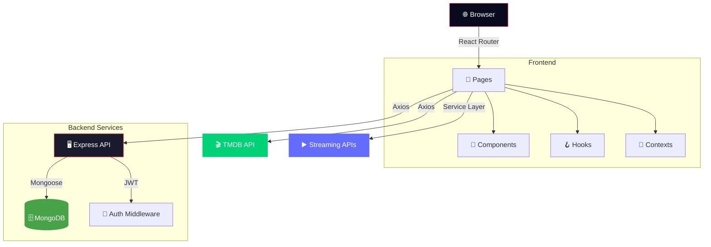

<div align="center">

<!-- Wave Header -->


<!-- Official Logo -->
<br/>

<br/>
<sub><strong>Full-Stack MERN Streaming Platform</strong></sub>
<br/><br/>

<!-- Dynamic Typing SVG -->
<a href="#">
  
</a>

<br/>

<!-- Badges Row 1 -->
[](https://react.dev/)
[](https://www.typescriptlang.org/)
[](https://vitejs.dev/)
[](https://tailwindcss.com/)

<!-- Badges Row 2 -->
[](https://expressjs.com/)
[](https://www.mongodb.com/)
[](https://www.themoviedb.org/)
[](https://vercel.com/)

<!-- Badges Row 3 -->
[](LICENSE)
[](CONTRIBUTING.md)

<br/>

<!-- Quick Preview Banner -->
<table>
<tr>
<td align="center"><strong>🏠 Home</strong></td>
<td align="center"><strong>🎬 Collections</strong></td>
<td align="center"><strong>🔍 Search</strong></td>
</tr>
<tr>
<td></td>
<td></td>
<td></td>
</tr>
<tr>
<td align="center"><strong>🎥 Detail</strong></td>
<td align="center"><strong>📋 My List</strong></td>
<td align="center"><strong>▶️ Watch</strong></td>
</tr>
<tr>
<td></td>
<td></td>
<td></td>
</tr>
</table>

> **📸 Replace the placeholders above with actual screenshots!**

</div>

---

##  &nbsp;About The Project

**CINEFLIX** is a full-stack streaming platform built from the ground up with the **MERN stack** (MongoDB, Express, React, Node.js). It delivers a premium Netflix-inspired experience — from cinematic hero carousels and hover preview cards to a complete authentication system and movie collection tracking.

> 🎯 **More than a clone** — CINEFLIX features smart collection discovery with 6,400+ TMDB collections, marathon tracking, franchise timelines, and a deeply customized UI with glassmorphism design, Framer Motion animations, and dynamic backgrounds.

<details>
<summary><strong>🤔 Why CINEFLIX?</strong></summary>

<br/>

| Problem | CINEFLIX Solution |
|---------|------------------|
| 🎭 Generic streaming UIs | Premium dark theme with glassmorphism, gradients & micro-animations |
| 📚 No collection browsing | Infinite scroll discovery of **6,400+** TMDB franchises |
| 🔐 No user accounts | Full JWT auth with signup, login & profile management |
| 📋 Can't save favorites | My List with watchlist & favorites, persisted to MongoDB |
| 🎬 Can't watch content | Integrated streaming with RiveStream & SmashyStream |
| 📊 No progress tracking | Marathon tracking, watched episodes, completion stats |

</details>

---

## ✨ Features

<div align="center">

```
┌─────────────────────────────────────────────────────────────────┐
│                        🎬 CINEFLIX WEB                          │
├─────────────────────────────────────────────────────────────────┤
│                                                                 │
│  🏠 HOME               │  📚 COLLECTIONS      │  🔍 SEARCH    │
│  ├─ Hero Carousel       │  ├─ Infinite Scroll  │  ├─ Enhanced  │
│  ├─ Hover Preview Cards │  ├─ Genre Filters    │  ├─ Multi-type│
│  ├─ Category Rows       │  ├─ Franchise Detail │  └─ Modal     │
│  ├─ Dynamic Backgrounds │  └─ Timeline View    │               │
│  └─ Content Carousels   │                      │               │
│                         │                      │               │
│  📋 MY LIST   │  🎥 DETAIL PAGE   │  ▶️ WATCH   │  👤 AUTH     │
│  ├─ Watchlist  │  ├─ Hero Backdrop │  ├─ Stream  │  ├─ Sign Up  │
│  ├─ Favorites  │  ├─ Cast & Crew   │  ├─ Multi   │  ├─ Login    │
│  ├─ Filtering  │  ├─ Trailers      │  │  Source   │  ├─ JWT     │
│  └─ Persistent │  ├─ Similar       │  └─ Player  │  └─ Profile  │
│                │  └─ Episodes      │             │              │
│                                                                 │
└─────────────────────────────────────────────────────────────────┘
```

</div>

### 🏠 Home Page
- **Cinematic hero carousel** with auto-rotation, backdrop images, and logo overlays
- **Hover preview cards** with intent detection, trailers, and quick actions
- **Category carousels** — Trending, Popular, Top Rated, Now Playing, Upcoming
- **Dynamic backgrounds** with animated gradient effects
- **Sign-up promo bubble** for unauthenticated users
- **Responsive design** — Desktop, tablet, and mobile layouts

### 📚 Collections — *Star Feature*
- **Infinite scroll discovery** of **6,400+** TMDB movie collections
- **Genre-based filtering** — Action, Sci-Fi, Fantasy, Horror, Animation, and more
- **Collection detail pages** with franchise timelines and film lists
- **Hero section** with featured collections and stats
- **Progress tracking** across film franchises

### 🔍 Search
- **Enhanced search** — Movies, TV Shows, and People in one query
- **Search modal** with keyboard shortcuts
- **Genre collection browsing** with curated grids
- **Real-time results** with intelligent ranking

### 🎥 Detail Pages
- **Full-screen hero** with backdrop, logos, and gradient overlays
- **Cast & Crew** sections with filmography links
- **Video trailers** with inline playback
- **Episode lists** for TV shows with season selection
- **Similar & Recommended** content carousels
- **Add to List** and **Like** buttons with animated feedback

### ▶️ Watch Page
- **Integrated streaming** via RiveStream and SmashyStream providers
- **Multi-source player** with fallback support
- **Episode tracking** for TV series watch progress

### 📋 My List
- **Watchlist management** — Add/remove movies and TV shows
- **Filtering** — All, Movies, TV Shows
- **Persistent storage** with MongoDB backend
- **Hover preview** with quick actions

### 👤 Authentication
- **Sign Up** — Email, username, and avatar selection
- **Login** — JWT-based secure authentication
- **Account page** — Profile management with preferences
- **Protected routes** — Content guarded behind auth

---

## 🎨 Design System

<div align="center">

| Token | Value | Usage |
|-------|-------|-------|
| 🌙 **Background** | `#141414` | Netflix dark — all screens |
| 🔴 **Accent** | `#E50914` | CTAs, active states, branding |
| 🟣 **Dark Purple** | `#0f0e14` | Deep sections |
| 🔵 **Purple Blue** | `#181524` | Card overlays |
| 📝 **Text Primary** | `#FFFFFF` | Headers, titles |
| 📝 **Text Secondary** | `#B3B3B3` | Body text, descriptions |
| 📝 **Text Muted** | `#808080` | Hints, labels |

</div>

> **Design Philosophy:** Cinematic dark theme inspired by premium streaming platforms with glassmorphism cards, Framer Motion animations, and smooth gradient transitions across every component.

---

## 🛠️ Tech Stack

<div align="center">

<!-- Skill Icons -->
<a href="https://skillicons.dev">
  
</a>

<br/><br/>

</div>

### Frontend

| Layer | Technology | Version | Purpose |
|-------|-----------|---------|---------|
| **UI Library** | React | 18.2 | Component-based UI |
| **Language** | TypeScript | 5.3 | Type safety |
| **Build Tool** | Vite | 5.x | Fast HMR & bundling |
| **Styling** | Tailwind CSS | 3.4 | Utility-first CSS |
| **Animations** | Framer Motion | 12.x | Premium animations |
| **Routing** | React Router | 6.8 | Client-side routing |
| **Icons** | Lucide React | 0.263 | Consistent SVG icons |
| **HTTP** | Axios | 0.21 | API communication |

### Backend

| Layer | Technology | Version | Purpose |
|-------|-----------|---------|---------|
| **Runtime** | Node.js | 18+ | Server environment |
| **Framework** | Express | 4.18 | REST API server |
| **Database** | MongoDB (Atlas) | 8.0 | User data & lists |
| **ODM** | Mongoose | 8.0 | MongoDB modeling |
| **Auth** | JWT + bcrypt | Latest | Secure authentication |
| **Hosting** | Vercel | Latest | Serverless deployment |

### External APIs

| Service | Purpose |
|---------|---------|
| **TMDB API v3** | Movies, TV shows, people, images, search |
| **RiveStream** | Video streaming source #1 |
| **SmashyStream** | Video streaming source #2 |

---

## 📁 Project Architecture

```
cineflix/
├── 📱 src/                              # Frontend source
│   ├── App.tsx                          # Root component + routes
│   ├── main.tsx                         # Entry point
│   │
│   ├── 📄 pages/                        # Route pages
│   │   ├── HomePage.tsx                 # 🏠 Landing + hero carousel
│   │   ├── BrowsePage.tsx               # 🎭 Browse content
│   │   ├── Movies.tsx                   # 🎬 Movies category
│   │   ├── TVShows.tsx                  # 📺 TV Shows category
│   │   ├── CollectionsPage.tsx          # 📚 Collection discovery
│   │   ├── CollectionDetailPage.tsx     # 📚 Franchise detail
│   │   ├── DetailPage.tsx               # 🎥 Movie/TV detail
│   │   ├── SearchPage.tsx               # 🔍 Search results
│   │   ├── NewPopularPage.tsx           # 🔥 New & Popular
│   │   ├── MyListPage.tsx               # 📋 User watchlist
│   │   ├── WatchPage.tsx                # ▶️ Video player
│   │   ├── AccountPage.tsx              # 👤 Profile settings
│   │   ├── LoginPage.tsx                # 🔐 Sign in
│   │   └── SignupPage.tsx               # 📝 Register
│   │
│   ├── 🧩 components/                   # Reusable UI
│   │   ├── Navbar.tsx                   # Navigation bar
│   │   ├── Footer.tsx                   # Site footer
│   │   ├── HeroCarousel.tsx             # Auto-rotating hero
│   │   ├── ContentCarousel.tsx          # Category row carousel
│   │   ├── ContentCard.tsx              # Card component
│   │   ├── MovieCard.tsx                # Movie-specific card
│   │   ├── HoverPreviewCard.tsx         # Hover intent preview
│   │   ├── FranchiseCard.tsx            # Collection card
│   │   ├── CollectionsHero.tsx          # Collections hero section
│   │   ├── CollectionsFilter.tsx        # Genre filter bar
│   │   ├── GenreCollections.tsx         # Genre browsing grid
│   │   ├── TimelineView.tsx             # Franchise timeline
│   │   ├── EnhancedSearch.tsx           # Search component
│   │   ├── SearchModal.tsx              # Search overlay
│   │   ├── FilterBar.tsx                # Content filters
│   │   ├── AddToListButton.tsx          # List action button
│   │   ├── LikeButton.tsx               # Like action button
│   │   ├── EpisodesList.tsx             # TV episode list
│   │   ├── DynamicBackground.tsx        # Animated backgrounds
│   │   ├── LogoImage.tsx                # Logo resolver
│   │   ├── LoadingSkeleton.tsx          # Shimmer skeletons
│   │   ├── SignUpPromoBubble.tsx         # Auth promo CTA
│   │   ├── Squares.tsx                  # Decorative grid
│   │   ├── ProtectedRoute.tsx           # Auth guard
│   │   └── ErrorBoundary.tsx            # Error handling
│   │
│   ├── ⚙️ services/                     # API & business logic
│   │   ├── tmdb.ts                      # TMDB API client
│   │   ├── api.ts                       # Backend API client
│   │   ├── collectionsService.ts        # Collection tracking
│   │   ├── myListService.ts             # Watchlist management
│   │   ├── watchService.ts              # Watch history
│   │   ├── progressService.ts           # Progress tracking
│   │   ├── logoCache.ts                 # Image cache layer
│   │   ├── rivestreamService.ts         # RiveStream provider
│   │   └── smashystream.ts              # SmashyStream provider
│   │
│   ├── 🪝 hooks/                        # Custom React hooks
│   │   ├── useMyList.ts                 # Watchlist hook
│   │   ├── useHoverIntent.ts            # Smart hover detection
│   │   ├── useAccountSettings.ts        # Profile management
│   │   └── useScreenSize.ts             # Responsive hook
│   │
│   ├── 🔐 contexts/                     # React context providers
│   │   ├── AuthContext.tsx              # Authentication state
│   │   └── ToastContext.tsx             # Notification system
│   │
│   ├── 📐 types/                        # TypeScript definitions
│   │   ├── index.ts                     # Core types
│   │   ├── browse.ts                    # Browse types
│   │   └── myList.ts                    # List types
│   │
│   └── 🔧 utils/                        # Utility functions
│       ├── imageLoader.ts               # Image optimization
│       ├── strings.ts                   # String helpers
│       └── validation.ts               # Form validation
│
├── 🖥️ backend/                          # Express API server
│   └── src/
│       ├── server.ts                    # Entry point
│       ├── config/
│       │   └── database.ts              # MongoDB connection
│       ├── models/
│       │   ├── User.ts                  # User schema
│       │   ├── MyList.ts                # Watchlist schema
│       │   ├── Collection.ts            # Collection schema
│       │   ├── Preferences.ts           # User preferences
│       │   └── WatchedEpisode.ts        # Episode tracking
│       ├── controllers/
│       │   ├── authController.ts        # Auth logic
│       │   ├── myListController.ts      # List CRUD
│       │   ├── collectionsController.ts # Collection ops
│       │   ├── preferencesController.ts # Settings ops
│       │   └── watchedEpisodeController.ts
│       ├── routes/
│       │   ├── authRoutes.ts            # /api/auth/*
│       │   ├── myListRoutes.ts          # /api/mylist/*
│       │   ├── collectionsRoutes.ts     # /api/collections/*
│       │   ├── preferencesRoutes.ts     # /api/preferences/*
│       │   └── watchedEpisodeRoutes.ts  # /api/episodes/*
│       └── middleware/
│           └── authMiddleware.ts        # JWT verification
│
├── 🎨 tailwind.config.js                # Design tokens
├── ⚡ vite.config.ts                    # Build config
├── 🚀 vercel.json                       # Deployment config
└── 📄 index.html                        # HTML entry point
```

---

## 🚀 Getting Started

### Prerequisites

| Tool | Version | Install |
|------|---------|---------|
| **Node.js** | ≥ 18.x | [nodejs.org](https://nodejs.org/) |
| **npm** | ≥ 9.x | Comes with Node.js |
| **Git** | Latest | [git-scm.com](https://git-scm.com/) |
| **MongoDB Atlas** | Free tier | [mongodb.com](https://www.mongodb.com/cloud/atlas/register) |
| **TMDB API Key** | Free | [tmdb.org/settings/api](https://www.themoviedb.org/settings/api) |

### Installation

```bash
# 1. Clone the repository
git clone https://github.com/simoabid/cineflix.git
cd cineflix

# 2. Install frontend dependencies
npm install

# 3. Install backend dependencies
cd backend && npm install && cd ..
```

### Configuration

<details>
<summary><strong>📦 Step 1: MongoDB Atlas Setup</strong></summary>

1. Sign up at [MongoDB Atlas](https://www.mongodb.com/cloud/atlas/register) (free)
2. Create a **New Project** → name it "CineFlix"
3. Click **Build a Database** → select **M0 Free** tier
4. Create a **Database User** (save the password!)
5. Go to **Network Access** → **Add IP Address** → **Allow Access from Anywhere** (`0.0.0.0/0`)
6. Go to **Database** → **Connect** → **Drivers** → copy the connection string
7. Replace `<password>` with your database user password

</details>

<details>
<summary><strong>🎬 Step 2: TMDB API Key</strong></summary>

1. Create an account at [themoviedb.org](https://www.themoviedb.org/)
2. Go to **Settings** → **API**
3. Request an API key (select "Developer")
4. Copy your **API Key (v3 auth)**

</details>

<details>
<summary><strong>🔐 Step 3: Environment Variables</strong></summary>

**Root `.env`** (frontend):
```env
VITE_TMDB_API_KEY=your_tmdb_api_key_here
```

**`backend/.env`** (backend):
```env
PORT=3001
MONGODB_URI=mongodb+srv://admin:<password>@cluster0.example.mongodb.net/?retryWrites=true&w=majority
JWT_SECRET=my_super_secure_secret_key_123
```

</details>

### Running the Project

```bash
# Start both frontend + backend concurrently
npm run dev

# Or start them separately:
# Terminal 1 — Backend
cd backend && npm run dev

# Terminal 2 — Frontend
npm run dev:frontend
```

> 💡 **Frontend:** `http://localhost:3000` &nbsp;|&nbsp; **Backend:** `http://localhost:3001`

---

## 📊 API Architecture



### Backend API Endpoints

| Method | Endpoint | Auth | Description |
|--------|----------|------|-------------|
| `POST` | `/api/auth/signup` | ❌ | Register new user |
| `POST` | `/api/auth/login` | ❌ | Authenticate user |
| `GET` | `/api/auth/profile` | ✅ | Get user profile |
| `GET` | `/api/mylist` | ✅ | Get user's watchlist |
| `POST` | `/api/mylist` | ✅ | Add to watchlist |
| `DELETE` | `/api/mylist/:id` | ✅ | Remove from watchlist |
| `GET` | `/api/collections` | ✅ | Get saved collections |
| `POST` | `/api/collections` | ✅ | Save collection progress |
| `GET` | `/api/preferences` | ✅ | Get user preferences |
| `PUT` | `/api/preferences` | ✅ | Update preferences |
| `GET` | `/api/episodes` | ✅ | Get watched episodes |
| `POST` | `/api/episodes` | ✅ | Mark episode watched |

---

## 🏗️ Key Implementation Details

<details>
<summary><strong>⚡ Performance Optimizations</strong></summary>

- **Vite HMR** — Instant hot module replacement during development
- **Code splitting** — React Router lazy loading per page
- **Image optimization** — `imageLoader` utility with fallback support
- **Logo caching** — `logoCache` service prevents redundant TMDB fetches
- **Debounced search** — Reduces API calls during typing
- **Hover intent detection** — `useHoverIntent` hook prevents accidental preview triggers
- **Skeleton loaders** — Perceived performance with shimmer animations
- **Intersection Observer** — Content loads as it enters viewport

</details>

<details>
<summary><strong>🎨 Animation System</strong></summary>

Built with Framer Motion for premium micro-interactions:

```tsx
// Staggered content entrance
<motion.div
  initial={{ opacity: 0, y: 20 }}
  animate={{ opacity: 1, y: 0 }}
  transition={{ duration: 0.5, delay: index * 0.1 }}
>

// Hover preview card
<motion.div
  whileHover={{ scale: 1.05 }}
  layoutId={`card-${id}`}
>

// Dynamic background gradients
<motion.div
  animate={{ background: gradientColors }}
  transition={{ duration: 2, ease: "easeInOut" }}
>
```

</details>

<details>
<summary><strong>🔐 Authentication Flow</strong></summary>

```
User Signs Up/Logs In
        │
        ▼
┌─────────────────────┐
│ POST /api/auth/login │
│ Email + Password     │
└──────────┬──────────┘
           │
           ▼
┌─────────────────────┐
│ bcrypt.compare()     │
│ Verify credentials   │
└──────────┬──────────┘
           │
           ▼
┌─────────────────────┐
│ jwt.sign()           │
│ Generate token       │
│ (24h expiry)         │
└──────────┬──────────┘
           │
           ▼
┌─────────────────────┐
│ AuthContext stores   │
│ token + user data    │
│ in localStorage      │
└──────────┬──────────┘
           │
           ▼
   🔓 Protected routes unlocked
   My List, Preferences, etc.
```

</details>

<details>
<summary><strong>📺 Streaming Integration</strong></summary>

- **Multi-source approach** — Falls back between RiveStream and SmashyStream
- **Embedded player** — Iframe-based streaming within the watch page
- **Episode tracking** — MongoDB persistence for TV show watch progress
- **Source selection** — Users can switch between available providers

</details>

---

## 📱 Pages Overview

| # | Page | Route | Key Features |
|---|------|-------|-------------|
| 1 | **Home** | `/` | Hero carousel, category rows, hover previews |
| 2 | **Browse** | `/browse` | Full content browsing |
| 3 | **Movies** | `/movies` | Movie category with filters |
| 4 | **TV Shows** | `/tvshows` | TV show category |
| 5 | **New & Popular** | `/new-popular` | Trending content |
| 6 | **Collections** | `/collections` | Infinite scroll franchise discovery |
| 7 | **Collection Detail** | `/collection/:id` | Franchise films & timeline |
| 8 | **Detail** | `/movie/:id`, `/tv/:id` | Full movie/show details |
| 9 | **Watch** | `/watch/:type/:id` | Video streaming player |
| 10 | **Search** | `/search` | Multi-type search |
| 11 | **My List** | `/my-list` | User watchlist |
| 12 | **Account** | `/account` | Profile & preferences |
| 13 | **Login** | `/login` | Authentication |
| 14 | **Sign Up** | `/signup` | Registration |

---

## 🚀 Deployment

The project is configured for **Vercel** deployment:

```bash
# Build for production
npm run build

# Preview production build locally
npm run preview
```

`vercel.json` handles both frontend static files and backend serverless functions.

---

## 🛠 Troubleshooting

<details>
<summary><strong>Common Issues & Fixes</strong></summary>

| Issue | Solution |
|-------|----------|
| **MongoDB Connection Error** | Check IP whitelist in Atlas → Network Access → `0.0.0.0/0` |
| **Movies not loading** | Verify `VITE_TMDB_API_KEY` in root `.env` |
| **Sign Up/Login fails** | Ensure backend is running on `http://localhost:3001` |
| **CORS errors** | Backend `cors` middleware should allow `localhost:3000` |
| **Build errors** | Run `npm install` in both root and `backend/` directories |

</details>

---

## 🤝 Contributing

Contributions are welcome! Here's how:

```bash
# 1. Fork the project
# 2. Create your feature branch
git checkout -b feature/amazing-feature

# 3. Commit your changes
git commit -m 'feat: add amazing feature'

# 4. Push to the branch
git push origin feature/amazing-feature

# 5. Open a Pull Request
```

### Commit Convention

| Prefix | Usage |
|--------|-------|
| `feat:` | New feature |
| `fix:` | Bug fix |
| `ui:` | Visual change |
| `refactor:` | Code improvement |
| `docs:` | Documentation |
| `perf:` | Performance |
| `auth:` | Authentication |
| `api:` | Backend/API |

---

## 📄 License

Distributed under the **MIT License**. See `LICENSE` for more information.

---

## 🙏 Acknowledgements

<div align="center">

| Resource | Purpose |
|----------|---------|
| [TMDB](https://www.themoviedb.org/) | Movie & TV Show database |
| [React](https://react.dev/) | UI framework |
| [Vite](https://vitejs.dev/) | Build tooling |
| [Tailwind CSS](https://tailwindcss.com/) | Utility-first styling |
| [Framer Motion](https://www.framer.com/motion/) | Premium animations |
| [MongoDB Atlas](https://www.mongodb.com/) | Cloud database |
| [Lucide Icons](https://lucide.dev/) | Beautiful icon set |
| [Vercel](https://vercel.com/) | Deployment platform |

</div>

---

<div align="center">

<!-- Footer Wave -->


<br/>

**Built with ❤️ using the MERN Stack**

<br/>

[](https://github.com/simoabid/cineflix-app)
&nbsp;&nbsp;
[](https://github.com/simoabid)

<br/>

<sub>If you found this useful, please consider giving it a ⭐!</sub>

</div>