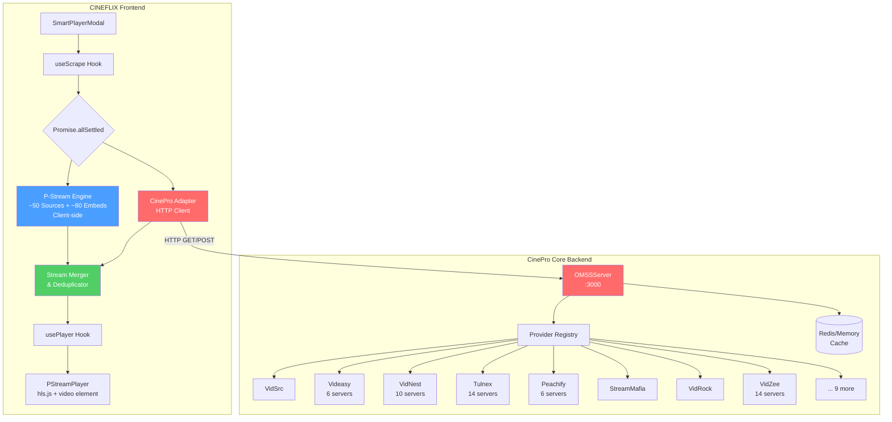

# Integrating CinePro Core into CINEFLIX Smart Player

A comprehensive plan to add 17+ new streaming providers from CinePro Core into the existing CINEFLIX smart player, significantly expanding streaming source coverage.

---

## Background & Architecture Analysis

### CINEFLIX Smart Player (Current)

The CINEFLIX player uses a **dual-mode architecture**:

| Mode | Engine | Providers | Runs Where |
|------|--------|-----------|------------|
| **Smart/Native** | P-Stream engine ([all.ts](file:///home/seemoo/Documents/CINEFLIX%20Project/src/lib/providers/engine/providers/all.ts)) | ~50 sources + ~80 embeds | Client-side (browser/extension/desktop) |
| **Classic/Iframe** | SmartPlayerContext + services | Rivestream, SmashyStream, 111Movies | Client-side (iframe embeds) |

Key files:
- [factory.ts](file:///home/seemoo/Documents/CINEFLIX%20Project/src/lib/providers/factory.ts) — Environment detection → provider config
- [extension.ts](file:///home/seemoo/Documents/CINEFLIX%20Project/src/lib/providers/extension.ts) — Browser extension bridge
- [stream-utils.ts](file:///home/seemoo/Documents/CINEFLIX%20Project/src/lib/providers/stream-utils.ts) — Stream format conversion
- [controls.ts](file:///home/seemoo/Documents/CINEFLIX%20Project/src/lib/providers/engine/entrypoint/controls.ts) — `ProviderControls` interface with `runAll()`
- [useScrape.ts](file:///home/seemoo/Documents/CINEFLIX%20Project/src/hooks/useScrape.ts) — Scraping orchestrator hook

### CinePro Core (New)

An OMSS-compliant **server-side** backend with:

| Aspect | Details |
|--------|---------|
| **Framework** | `@omss/framework` (BaseProvider pattern) |
| **Providers** | 17 providers (14 enabled) — VidSrc, Videasy, VidNest, Tulnex, Peachify, Popr, StreamMafia, VidRock, VidZee, VixSrc, Icefy, CineSu, VidApi, FshareTV + 3 disabled |
| **Server** | Hono-based HTTP server with auto-discovery |
| **Caching** | Memory or Redis (1h sources, 24h subtitles) |
| **Proxy** | Built-in stream proxying + third-party proxy unwrapping |
| **Deployment** | Docker, Vercel, Cloudflare Workers, Render |

Key files:
- [server.ts](file:///home/seemoo/Documents/CINEFLIX%20Project/core/src/server.ts) — Server entry point
- [thirdPartyProxies.ts](file:///home/seemoo/Documents/CINEFLIX%20Project/core/src/thirdPartyProxies.ts) — Proxy URL unwrapping
- [streamPatterns.ts](file:///home/seemoo/Documents/CINEFLIX%20Project/core/src/streamPatterns.ts) — Stream URL identification
- [vidsrc.ts](file:///home/seemoo/Documents/CINEFLIX%20Project/core/src/providers/vidsrc/vidsrc.ts) — Example provider (BaseProvider pattern)
- [videasy.ts](file:///home/seemoo/Documents/CINEFLIX%20Project/core/src/providers/videasy/videasy.ts) — Complex multi-server provider example

### Critical Differences

| Dimension | CINEFLIX (P-Stream) | CinePro Core (OMSS) |
|-----------|--------------------|--------------------|
| **Execution** | Client-side (browser/extension) | Server-side (Node.js) |
| **Provider pattern** | `Sourcerer` → discovers `Embed[]` → runs embeds | `BaseProvider.getMovieSources()` / `getTVSources()` |
| **Stream types** | `HlsBasedStream` / `FileBasedStream` with qualities map | `Source` with `url`, `type`, `quality` string |
| **Media input** | `ScrapeMedia` (`tmdbId`, `title`, `releaseYear`, `type`, `season`, `episode`) | `ProviderMediaObject` (`tmdbId`, `type`, `s`, `e`, `imdbId`, `title`) |
| **Proxy model** | Client-side CORS proxy / extension / M3U8 proxy | Server-side `createProxyUrl()` wraps all URLs through CinePro's proxy |
| **Captions** | `Stream.captions[]` with `hasCorsRestrictions` | `Subtitle[]` with `format` |

---

## Integration Approaches Evaluated

### Approach A: Port CinePro Providers to P-Stream Engine
Rewrite each CinePro provider as a P-Stream `Sourcerer`.

> [!WARNING]
> **Not recommended.** CinePro providers use server-side `fetch` (no CORS), Node.js `crypto.subtle`, and multi-step page scraping — none of which work client-side in a browser. This would require massive rewrites and would break most providers.

### Approach B: Replace P-Stream with CinePro Core Backend
Point the entire smart player at a CinePro Core instance.

> [!WARNING]
> **Not recommended.** This would **lose all 50+ existing P-Stream sources** that work client-side. The P-Stream engine is mature and provides the majority of current streams.

### Approach C: Hybrid — Run CinePro Core as a Supplementary Backend ✅

> [!TIP]
> **Recommended.** Keep the existing P-Stream engine for client-side scraping AND add CinePro Core as an additional backend source. A lightweight adapter layer bridges the two systems, merging results seamlessly.

**Why this is the best approach:**
1. **Zero breaking changes** — existing P-Stream sources continue working
2. **Additive, not destructive** — 17 new server-side providers are added on top
3. **Clean separation** — CinePro runs as an independent service, easy to update
4. **Redundancy** — if client-side scraping fails, server-side providers may still work
5. **The API contracts are compatible** — both use TMDB IDs, same media types, similar stream formats
6. **CinePro's proxy handles CORS** — all streams come proxied, playable in any browser

---

## Open Questions

> [!IMPORTANT]
> **Q1: Deployment preference for CinePro Core?**
> - Run locally alongside the dev server (simplest for development)
> - Docker container (recommended for production)
> - Serverless (Vercel/Cloudflare Workers — cheapest but limited)
> Please confirm which deployment model you prefer.

> [!IMPORTANT]
> **Q2: Provider overlap handling?**
> Some providers exist in both systems (e.g., VidSrc, VidNest, VidRock). Should we:
> - A) Keep both and deduplicate streams by URL at the merge layer
> - B) Disable overlapping CinePro providers and only keep unique ones
> - C) Let users configure which sources to prefer
> I recommend option A (deduplicate automatically) as the default.

> [!IMPORTANT]
> **Q3: TMDB API key sharing?**
> CinePro Core requires a `TMDB_API_KEY`. Does CINEFLIX already have one configured, or should we provision a separate key for the CinePro backend?

> [!IMPORTANT]
> **Q4: Redis caching?**
> CinePro Core supports Redis for production caching (1h source TTL, 24h subtitle TTL). Should we:
> - A) Use in-memory caching (simpler, fine for personal use)
> - B) Set up Redis (better for shared/production instances)

---

## Proposed Changes

### Phase 1: CinePro Core Setup & Configuration

Get CinePro Core running as a standalone service.

---

#### [MODIFY] [.env.example](file:///home/seemoo/Documents/CINEFLIX%20Project/core/.env.example)
- Set `CORS_ORIGIN` to CINEFLIX's development URL (`http://localhost:5173` or configured port)
- Set `HOST=0.0.0.0` for network access
- Configure `TMDB_API_KEY`

#### [NEW] `core/.env`
- Copy from `.env.example` with actual values
- Set `CORS_ORIGIN` to match CINEFLIX frontend origin

#### [NEW] `scripts/start-cinepro.sh`
- Shell script to install dependencies and start CinePro Core
- Used for development convenience

---

### Phase 2: CinePro Adapter Service

Create an adapter layer in CINEFLIX that communicates with CinePro Core and translates responses into P-Stream-compatible types.

---

#### [NEW] `src/services/cinepro-adapter/types.ts`
TypeScript types for the CinePro API contract:

```typescript
/** CinePro API response types (OMSS format) */
interface CineProSource {
  url: string;
  type: 'hls' | 'mp4' | 'dash' | 'mkv' | 'webm';
  quality: string;
  audioTracks: Array<{ language: string; label: string }>;
  provider: { id: string; name: string };
}

interface CineProSubtitle {
  url: string;
  label: string;
  format: 'vtt' | 'srt' | 'ass' | 'ssa' | 'ttml';
}

interface CineProDiagnostic {
  code: string;
  message: string;
  severity: 'info' | 'warning' | 'error';
}

interface CineProScrapeResponse {
  sources: CineProSource[];
  subtitles: CineProSubtitle[];
  diagnostics: CineProDiagnostic[];
}

interface CineProProviderInfo {
  id: string;
  name: string;
  enabled: boolean;
}
```

#### [NEW] `src/services/cinepro-adapter/client.ts`
HTTP client for communicating with CinePro Core:

- `fetchCineProStreams(media: ScrapeMedia): Promise<CineProScrapeResponse>` — POST to `/scrape`
- `fetchCineProProviders(): Promise<CineProProviderInfo[]>` — GET `/providers`
- `checkCineProHealth(): Promise<boolean>` — GET `/health`
- Error handling with timeout (15s) and retry (2 attempts)
- Configurable base URL via `VITE_CINEPRO_URL` env var

#### [NEW] `src/services/cinepro-adapter/mapper.ts`
Maps CinePro API responses to CINEFLIX's internal types:

```typescript
/** Maps CineProSource → P-Stream compatible Stream */
function mapCineProSourceToStream(source: CineProSource): Stream

/** Maps CineProSubtitle → CaptionListItem */  
function mapCineProSubtitleToCaption(subtitle: CineProSubtitle): CaptionListItem

/** Maps ScrapeMedia → CinePro API request params */
function mapScrapeMediaToRequest(media: ScrapeMedia): CineProScrapeRequest

/** Normalizes CinePro quality strings to P-Stream Qualities */
function mapQuality(quality: string): Qualities
```

**Key mapping logic:**

| CinePro Field | CINEFLIX Field | Transformation |
|--------------|----------------|----------------|
| `source.url` (already proxied) | `stream.playlist` (HLS) or `stream.qualities[q].url` (file) | Direct assignment — CinePro proxy URLs are already playable |
| `source.type: 'hls'` | `{ type: 'hls', playlist: url }` | Map to `HlsBasedStream` |
| `source.type: 'mp4'` | `{ type: 'file', qualities: { [q]: { url } } }` | Map to `FileBasedStream` |
| `source.quality: '1080'` | `Qualities: '1080p'` | Append 'p' suffix if missing |
| `subtitle.format: 'vtt'` | `caption.type: 'vtt'` | Direct mapping |
| `subtitle.url` (proxied) | `caption.url`, `needsProxy: false` | Already proxied by CinePro |

#### [NEW] `src/services/cinepro-adapter/index.ts`
Public API — re-exports client + mapper + types.

---

### Phase 3: Integration into Scraping Pipeline

Wire CinePro results into the existing smart player flow. This is the core integration work.

---

#### [MODIFY] [useScrape.ts](file:///home/seemoo/Documents/CINEFLIX%20Project/src/hooks/useScrape.ts)
Enhance the scraping hook to query CinePro Core **in parallel** with P-Stream:

```
Current flow:
  startScraping() → providers.runAll() → return first success

New flow:
  startScraping() → 
    Promise.allSettled([
      providers.runAll(),           // P-Stream (client-side)
      fetchCineProStreams(media),    // CinePro (server-side)
    ])
    → Merge + deduplicate results
    → Return best stream (by quality + rank)
```

Key changes:
- Import `fetchCineProStreams` and mapper functions from the adapter
- Run CinePro fetch in parallel with P-Stream scraping
- If P-Stream finds a stream first, use it immediately (current behavior preserved)
- CinePro results are mapped and appended to the source list as they arrive
- New `cineproSources` state tracks CinePro-specific results
- Deduplicate by comparing stream URLs (normalized)
- Add `sourceOrigin: 'pstream' | 'cinepro'` tag to track provenance

#### [MODIFY] [SmartPlayerModal.tsx](file:///home/seemoo/Documents/CINEFLIX%20Project/src/components/SmartPlayerModal.tsx)
Minimal changes to support CinePro-sourced streams:

- Show CinePro provider badge when playing a CinePro-sourced stream
- Add CinePro sources to the stream selector UI
- Handle CinePro connection errors gracefully (fall back to P-Stream only)

---

### Phase 4: Configuration & Settings UI

Add user-facing controls for managing CinePro integration.

---

#### [NEW] `src/stores/cinepro/index.ts`
Zustand store for CinePro configuration (persisted):

```typescript
interface CineProStore {
  /** CinePro Core server URL */
  serverUrl: string;
  
  /** Whether CinePro integration is enabled */
  isEnabled: boolean;
  
  /** Connection status */
  connectionStatus: 'connected' | 'disconnected' | 'checking';
  
  /** List of available CinePro providers */
  availableProviders: CineProProviderInfo[];
  
  /** Provider IDs the user has disabled */
  disabledProviderIds: string[];
  
  /** Whether to prefer CinePro results over P-Stream */
  preferCinePro: boolean;
  
  // Actions
  setServerUrl: (url: string) => void;
  toggleEnabled: () => void;
  checkConnection: () => Promise<void>;
  toggleProvider: (id: string) => void;
}
```

#### [MODIFY] Settings page/component
Add a "CinePro Integration" settings section:
- Server URL input field (default: `http://localhost:3000`)
- Enable/Disable toggle
- Connection status indicator (green/red dot)
- "Test Connection" button
- Provider list with individual toggles
- "Prefer CinePro" toggle for source priority

---

### Phase 5: Stream Selector Enhancement

Enhance the stream selection UI to show CinePro sources alongside P-Stream sources.

---

#### [MODIFY] Stream selector component
- Group sources by origin: "Smart Scraper" (P-Stream) and "CinePro" sections  
- Show provider name and quality for each CinePro source
- Visual distinction (icon/badge) for CinePro sources
- "Server-side" indicator to communicate that these don't require extension/proxy

#### [MODIFY] [source.ts](file:///home/seemoo/Documents/CINEFLIX%20Project/src/stores/player/source.ts) (SourceSlice)
- Add `sourceOrigin` field to track whether stream came from P-Stream or CinePro
- Add `cineproProviderName` field for display purposes
- Include CinePro diagnostics in error reporting

---

### Phase 6: Environment & Deployment Configuration

---

#### [MODIFY] `.env` / `.env.example` (CINEFLIX root)
Add new environment variables:

```env
# CinePro Core Integration
VITE_CINEPRO_URL=http://localhost:3000    # CinePro Core server URL
VITE_CINEPRO_ENABLED=true                 # Enable/disable CinePro integration
VITE_CINEPRO_TIMEOUT=15000                # Request timeout in ms
```

#### [NEW] `docker-compose.yml` (project root — optional)
Docker Compose for running CINEFLIX + CinePro Core together:

```yaml
services:
  cineflix:
    build: .
    ports:
      - "5173:5173"
    environment:
      - VITE_CINEPRO_URL=http://cinepro:3000
      
  cinepro:
    build: ./core
    ports:
      - "3000:3000"
    environment:
      - TMDB_API_KEY=${TMDB_API_KEY}
      - HOST=0.0.0.0
      - CORS_ORIGIN=http://localhost:5173
      - CACHE_TYPE=memory
```

---

### Phase 7: Error Handling, Logging & Monitoring

---

#### [NEW] `src/services/cinepro-adapter/health.ts`
Health check service:
- Periodic health check (every 60s when enabled)
- Auto-disable CinePro on repeated failures
- Auto-re-enable on recovery
- Connection status events for the UI

#### [MODIFY] Existing error handling
- CinePro failures should NEVER break existing P-Stream functionality
- CinePro errors are logged but not shown as player errors
- If CinePro is unreachable, the system silently falls back to P-Stream-only mode
- Diagnostics from CinePro (partial scrapes, provider errors) are available in a debug panel

---

## Architecture Diagram



---

## Provider Overlap Analysis

Providers that exist in **both** CINEFLIX P-Stream and CinePro Core:

| Provider | CINEFLIX P-Stream | CinePro Core | Notes |
|----------|------------------|--------------|-------|
| VidSrc | ✅ `vidsrcvipScraper` | ✅ `VidSrcProvider` | Different implementations — CinePro uses newer `vsembed.ru` endpoint |
| VidNest | ✅ `vidnestScraper` | ✅ `VidNestProvider` | Both query similar servers — deduplicate by URL |
| VidRock | ✅ `vidrockScraper` | ✅ `VidRockProvider` | Similar encryption approach |
| FshareTV | ✅ `fsharetvScraper` | ✅ `FshareTVProvider` | Same site, different scraping logic |

**Unique to CinePro (not in CINEFLIX):**
- ✨ Videasy (6 servers: cuevana, mb-flix, 1movies, cdn, superflix, lamovie)
- ✨ Tulnex (14 servers with 4-layer encryption)
- ✨ Peachify (6 servers: moviebox, holly, air, multi, net, bmb)
- ✨ Popr (10 servers)
- ✨ StreamMafia (session-based, encrypted)
- ✨ VidZee (14 servers with dynamic key)
- ✨ VixSrc (token-based HLS)
- ✨ Icefy (simple JSON API)
- ✨ CineSu (direct HLS manifest)
- ✨ VidApi (Russian endpoint)
- ✨ 02MovieDownloader (disabled — Cloudflare protected)
- ✨ AnyEmbed (disabled — unstable)
- ✨ FMovies4U (disabled — broken)

**This means CinePro adds at least 10 unique, working providers** that don't exist in the current CINEFLIX engine.

---

## File Impact Summary

| Change Type | Files | Description |
|------------|-------|-------------|
| **NEW** | 6 | CinePro adapter (types, client, mapper, health, index), CinePro store |
| **MODIFY** | 5 | useScrape hook, SmartPlayerModal, SourceSlice, stream selector, settings |
| **CONFIG** | 3 | .env files (CINEFLIX + CinePro), docker-compose |
| **SCRIPT** | 1 | start-cinepro.sh convenience script |
| **Total** | ~15 files | Minimal footprint, no changes to P-Stream engine internals |

---

## Verification Plan

### Automated Tests

```bash
# 1. CinePro adapter unit tests
npx vitest run src/services/cinepro-adapter/

# 2. Mapper tests — verify type conversions
npx vitest run src/services/cinepro-adapter/mapper.test.ts

# 3. Integration test — mock CinePro API + verify merged results
npx vitest run src/hooks/__tests__/useScrape.cinepro.test.ts

# 4. Existing tests still pass (no regressions)
npx vitest run
```

### Manual Verification

1. **CinePro Core standalone**: Start CinePro Core, verify it serves streams at `http://localhost:3000`
2. **Connection test**: Open CINEFLIX settings → CinePro section → "Test Connection" shows green
3. **Merged scraping**: Play a movie → verify both P-Stream and CinePro sources appear in stream selector
4. **CinePro-only playback**: Disable all P-Stream sources → verify CinePro streams play correctly
5. **Graceful degradation**: Stop CinePro Core → verify CINEFLIX still works with P-Stream only (no errors shown)
6. **Deduplication**: Play content available in both → verify no duplicate stream entries
7. **Subtitle integration**: Verify CinePro subtitles appear in caption selector
8. **Quality mapping**: Verify quality labels (1080p, 720p, etc.) display correctly for CinePro streams

### Edge Cases

- CinePro Core returns empty results → P-Stream results used exclusively
- CinePro Core returns faster than P-Stream → CinePro stream used, P-Stream results merged later
- CinePro Core timeout → silently ignored, P-Stream continues
- Both return results for same content → merged and deduplicated
- TV show with season/episode → CinePro receives correct `s` and `e` params

---

## Implementation Order

| Phase | Effort | Description |
|-------|--------|-------------|
| **1** | 1h | Set up and configure CinePro Core |
| **2** | 3-4h | Build the adapter service (types, client, mapper) |
| **3** | 3-4h | Integrate into scraping pipeline (useScrape + SmartPlayerModal) |
| **4** | 2-3h | Configuration store + settings UI |
| **5** | 2h | Stream selector UI enhancement |
| **6** | 1h | Environment config + deployment setup |
| **7** | 2h | Health checks, error handling, tests |
| **Total** | ~14-17h | Across 7 phases |

> [!NOTE]
> Each phase is independently testable. Phase 1-3 deliver the core value (new streams working). Phases 4-7 add polish, configuration, and robustness.
