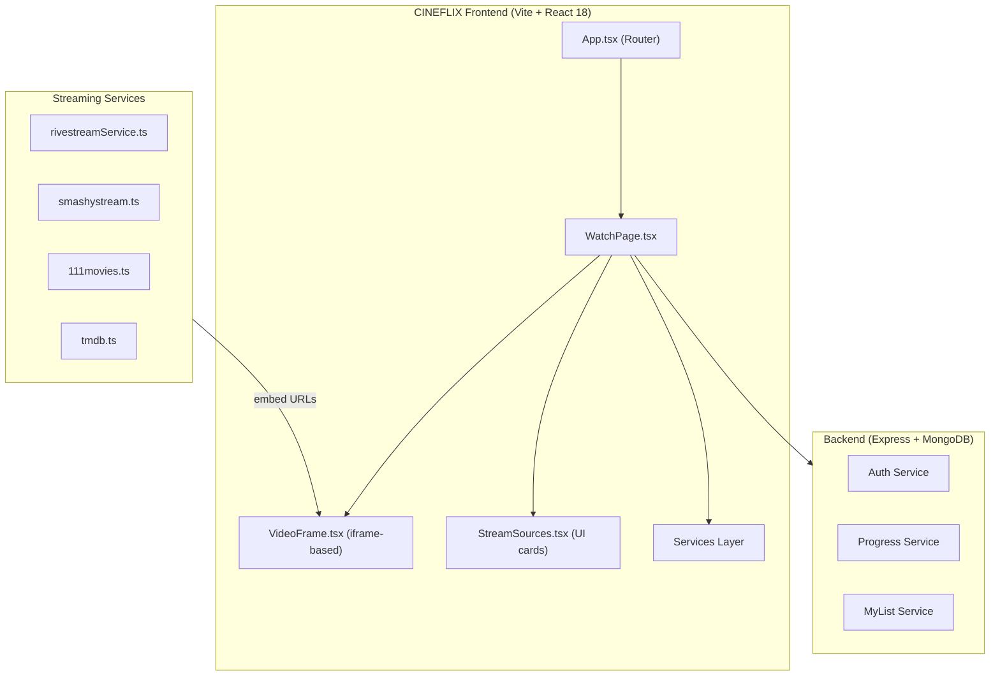
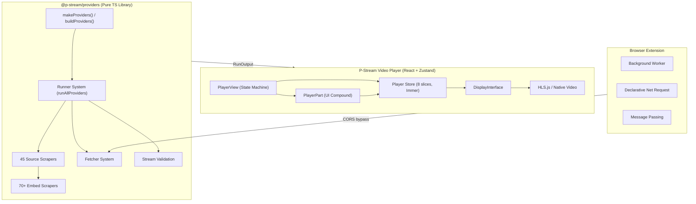
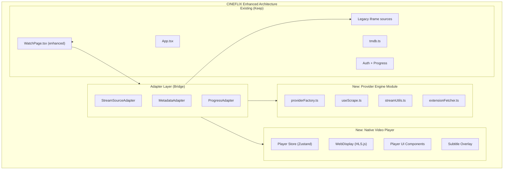
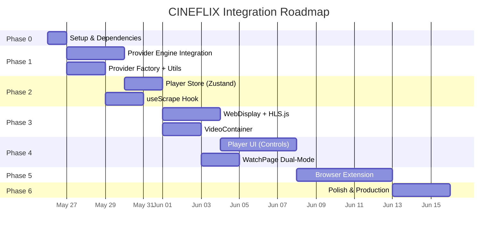

# P-Stream → CINEFLIX Integration Strategy
# Comprehensive Technical Analysis & Migration Plan

> **Document Type:** Architecture Integration Blueprint  
> **Source Project:** P-Stream Ecosystem (archived, 5 sub-projects)  
> **Target Project:** CINEFLIX (React + Vite + Tailwind + Express/MongoDB)  
> **Date:** 2026-05-25

---

## Table of Contents

1. [Deep Technical Analysis](#1-deep-technical-analysis)
2. [Architecture Mapping & Compatibility](#2-architecture-mapping--compatibility)
3. [Risk Analysis](#3-risk-analysis)
4. [Separation Boundaries](#4-separation-boundaries)
5. [Refactoring Recommendations](#5-refactoring-recommendations)
6. [Phased Implementation Roadmap](#6-phased-implementation-roadmap)
7. [Prioritized Execution Steps](#7-prioritized-execution-steps)

---

## 1. Deep Technical Analysis

### 1.1 CINEFLIX Current Architecture



**Key Characteristics:**

| Aspect | CINEFLIX Current State |
|---|---|
| **Video Player** | **iframe-based** — loads third-party embed URLs directly in a sandboxed `<iframe>`. No native `<video>` element, no HLS.js, no custom controls. |
| **Source Discovery** | **Simple URL generation** — services build URLs from templates (e.g., `vidjoy.pro/embed/{type}/{id}`). No actual HTML scraping, no embed extraction. |
| **Stream Sources** | 3 providers: Rivestream (~8 servers), SmashyStream (~6 variants), 111movies (~6 variants). ~20 total sources. |
| **Quality Control** | None — quality is whatever the embed iframe provides. No HLS quality switching, no file-based quality selection. |
| **Subtitles** | Handled entirely by embed iframe. No custom subtitle rendering. |
| **Error Recovery** | Simple retry on iframe error. No source cascading, no failed-source tracking. |
| **Progress Tracking** | Heuristic — measures wall-clock time since page load, not actual playback position. |
| **State Management** | React `useState` throughout. No Zustand, no centralized player store. |
| **Stack** | React 18, Vite 4, Tailwind 3, Framer Motion, react-router-dom 6, axios, Express, MongoDB/Mongoose |

### 1.2 P-Stream Architecture



**Key Characteristics:**

| Aspect | P-Stream |
|---|---|
| **Video Player** | **Native `<video>` + HLS.js** — custom controls, quality switching, PiP, AirPlay, Chromecast, keyboard shortcuts, skip segments |
| **Source Discovery** | **Deep HTML scraping** — Fuse.js fuzzy matching, embed page parsing, stream URL extraction from JavaScript. 45 sources + 70 embeds. |
| **Quality Control** | Full quality management — HLS adaptive bitrate, file-based quality selection with smart fallback algorithm |
| **Subtitles** | Custom subtitle overlay, external subtitle scraping, Google Translate integration, caption sync delay |
| **Error Recovery** | Sophisticated — per-media failed source tracking, embed cascading, smart retry from last-known-good source |
| **Progress Tracking** | Exact — reads from `<video>` element's `currentTime`, `duration`, `buffered` properties |
| **State Management** | Zustand + Immer with 8 specialized slices |
| **Stack** | React 18, TypeScript, Zustand, Immer, HLS.js, Vite |

### 1.3 Architectural Gap Analysis

```
                    CINEFLIX                          P-Stream
                    ════════                          ════════

Source Discovery    URL Templates (3 providers)  →   HTML Scraping (45+70 scrapers)
                    ▓▓░░░░░░░░░░░░░░░░░░░░░░░░      ▓▓▓▓▓▓▓▓▓▓▓▓▓▓▓▓▓▓▓▓▓▓▓▓▓▓

Video Rendering     Sandboxed iframe             →   Native <video> + HLS.js
                    ▓▓▓░░░░░░░░░░░░░░░░░░░░░░░      ▓▓▓▓▓▓▓▓▓▓▓▓▓▓▓▓▓▓▓▓▓▓▓▓▓▓

Player Controls     Embed-provided               →   Full custom UI (30+ atoms)
                    ▓░░░░░░░░░░░░░░░░░░░░░░░░░      ▓▓▓▓▓▓▓▓▓▓▓▓▓▓▓▓▓▓▓▓▓▓▓▓▓▓

State Management    React useState               →   Zustand + Immer (8 slices)
                    ▓▓░░░░░░░░░░░░░░░░░░░░░░░░      ▓▓▓▓▓▓▓▓▓▓▓▓▓▓▓▓▓▓▓▓▓▓▓▓▓▓

Error Recovery      Simple retry                 →   Per-media cascading, tracking
                    ▓▓░░░░░░░░░░░░░░░░░░░░░░░░      ▓▓▓▓▓▓▓▓▓▓▓▓▓▓▓▓▓▓▓▓▓▓▓▓▓▓

CORS Handling       None (iframe handles it)     →   Extension + proxy system
                    ░░░░░░░░░░░░░░░░░░░░░░░░░░      ▓▓▓▓▓▓▓▓▓▓▓▓▓▓▓▓▓▓▓▓▓▓▓▓▓▓

Subtitle System     Embed-provided               →   Custom render + external + translate
                    ▓░░░░░░░░░░░░░░░░░░░░░░░░░      ▓▓▓▓▓▓▓▓▓▓▓▓▓▓▓▓▓▓▓▓▓▓▓▓▓▓
```

> [!IMPORTANT]
> The gap is **massive**. CINEFLIX currently has a fundamentally different architecture — it delegates nearly everything to iframes. P-Stream handles everything natively. This is not a "drop-in replacement" scenario. It is a **paradigm shift** in how streaming content is delivered and rendered.

---

## 2. Architecture Mapping & Compatibility

### 2.1 Technology Stack Compatibility

| Technology | CINEFLIX | P-Stream | Compatibility |
|---|---|---|---|
| React | 18.2 | 18.x | ✅ Perfect |
| TypeScript | 5.0 | 5.x | ✅ Perfect |
| Vite | 4.4 | Vite | ✅ Perfect |
| Router | react-router-dom 6 | react-router-dom 6 | ✅ Perfect |
| State Mgmt | useState | Zustand + Immer | ⚠️ **Addition needed** |
| Styling | TailwindCSS 3 | CSS Modules / Custom | ⚠️ Need to adapt player UI to Tailwind |
| Animation | Framer Motion | None built-in | ✅ Can enhance P-Stream player with FM |
| HTTP | axios | Custom Fetcher system | ⚠️ P-Stream has its own fetcher |
| Video | iframe | HLS.js + native | 🔴 **Complete replacement** |
| Backend | Express + MongoDB | Nitro + Prisma + Postgres | ⚠️ Keep CINEFLIX backend, add endpoints |

### 2.2 Data Model Compatibility

```typescript
// CINEFLIX StreamSource (current)
interface StreamSource {
  id: string;
  name: string;
  url: string;                    // ← Embed URL loaded in iframe
  type: 'direct' | 'hls' | 'mp4';
  quality: 'SD' | 'HD' | 'FHD' | '4K';
  fileSize?: string;
  reliability: 'Fast' | 'Stable' | 'Premium';
  isAdFree: boolean;
  language?: string;
  subtitles?: string[];
}

// P-Stream RunOutput (what providers return)
interface RunOutput {
  sourceId: string;
  embedId?: string;
  stream: {
    type: 'file' | 'hls';
    // For HLS:
    playlist?: string;           // ← Actual m3u8 URL
    // For file:
    qualities?: Record<Quality, { url: string }>;  // ← Direct MP4 URLs per quality
    captions: Caption[];
    flags: string[];
    headers?: Record<string, string>;
  };
}
```

> [!WARNING]
> **Fundamental mismatch:** CINEFLIX's `StreamSource.url` is an *embed page URL* loaded in an iframe. P-Stream's `RunOutput.stream` contains *raw media URLs* (m3u8/mp4) that require a native `<video>` element. These are conceptually different systems that cannot be mixed without an adapter layer.

### 2.3 Integration Architecture (Proposed)



> [!TIP]
> **The Adapter Layer is the key architectural decision.** It allows CINEFLIX to support *both* the existing iframe sources AND the new P-Stream native player simultaneously. Users can be offered both modes, and the system can fall back to iframes when native scraping fails.

---

## 3. Risk Analysis

### 3.1 Risk Matrix

| Risk | Severity | Probability | Impact | Mitigation |
|---|---|---|---|---|
| **CORS blocking** without extension | 🔴 Critical | 🔴 High | Most scrapers fail in browser-only mode | Build extension OR accept limited browser-only mode |
| **Scraper breakage** (archived project) | 🔴 Critical | 🟡 Medium | Source websites change, scrapers stop working | Implement health monitoring, easy disable per-scraper |
| **Legal exposure** from embedded scrapers | 🔴 Critical | 🟡 Medium | Terms of service violations, DMCA risk | Modular design: scrapers as a separate package, easy removal |
| **HLS.js integration complexity** | 🟡 Medium | 🟡 Medium | Quality switching bugs, codec issues | Thorough testing, Safari native HLS fallback |
| **Bundle size increase** | 🟡 Medium | 🔴 High | HLS.js (~700KB), cheerio, fuse.js add up | Dynamic import providers library, tree-shake |
| **State management migration** | 🟡 Medium | 🟢 Low | Zustand conflicts with existing useState | Keep separate — Zustand for player only |
| **Existing iframe regression** | 🟡 Medium | 🟢 Low | Breaking current working streams | Keep as fallback mode, don't remove |
| **TypeScript strictness mismatch** | 🟢 Low | 🟡 Medium | Type errors during integration | Incremental strictness, use `@ts-expect-error` sparingly |
| **Dependency conflicts** | 🟢 Low | 🟢 Low | Version clashes (unlikely given similar stacks) | Audit with `npm ls`, resolve duplicates |

### 3.2 Dependency Audit

**New dependencies required:**

```
CRITICAL (Provider Engine):
  cheerio           ~2.3MB   HTML parsing for scrapers
  fuse.js           ~30KB    Fuzzy search matching
  hls-parser        ~50KB    M3U8 playlist parsing
  iso-639-1         ~30KB    Language code mapping
  crypto-js         ~300KB   Encryption for some scrapers

CRITICAL (Video Player):
  zustand           ~10KB    State management
  immer             ~20KB    Immutable state updates
  hls.js            ~700KB   HLS stream playback

OPTIONAL (can defer):
  form-data         ~30KB    Multipart form handling
  cookie            ~10KB    Cookie parsing
  nanoid            ~1KB     Unique ID generation
```

> [!WARNING]
> **Bundle impact:** The providers library with all 45 sources + 70 embeds + dependencies will add approximately **4-5MB** to the bundle. **Mandatory mitigation:** Use dynamic `import()` for the providers module so it only loads when the user enters the WatchPage. HLS.js should also be dynamically imported.

### 3.3 Critical Decision Points

````carousel
### Decision 1: Extension vs. Proxy-Only

**Extension approach:**
- ✅ All 45+ sources available
- ✅ Best CORS bypass
- ✅ IP consistency (user's real IP)
- ❌ Users must install extension
- ❌ Chrome Web Store review risk

**Proxy-only approach:**
- ✅ No extension needed
- ❌ Only CORS-allowed sources (~10 of 45)
- ❌ Proxy hosting costs
- ❌ IP mismatches may cause blocks

**Recommendation:** Start proxy-only, build extension as Phase 5.
<!-- slide -->
### Decision 2: Replace vs. Augment Iframes

**Replace (full native player):**
- ✅ Full quality control
- ✅ Custom UI everywhere
- ✅ Accurate progress tracking
- ❌ Lose working iframe sources
- ❌ Higher implementation effort

**Augment (dual mode):**
- ✅ Keep existing working sources as fallback
- ✅ Gradual migration
- ✅ Lower risk
- ❌ Maintain two systems
- ❌ Inconsistent UX

**Recommendation:** Augment first (keep iframes as fallback), then gradually replace.
<!-- slide -->
### Decision 3: Copy vs. Package the Providers

**Copy into project:**
- ✅ Full control over scrapers
- ✅ Can modify/fix/update freely
- ✅ No external dependency
- ❌ Large code dump (~45 source files + 70 embed files)
- ❌ Manual updates

**Install as npm package:**
- ✅ Clean dependency boundary
- ✅ Easy to replace/update
- ❌ Archived repo — no future updates
- ❌ Must fork for modifications

**Recommendation:** Copy the `providers/src/` into `src/lib/providers/` — the project is archived so there's no upstream to sync with. Full ownership is better.
````

---

## 4. Separation Boundaries

### 4.1 Module Architecture

```
src/
├── lib/
│   └── providers/                    ← NEW: P-Stream providers (isolated module)
│       ├── engine/                   ← Core library (copied from providers/src/)
│       │   ├── entrypoint/           ← makeProviders, buildProviders
│       │   ├── providers/            ← Source + embed scrapers
│       │   ├── runners/              ← Runner pipeline
│       │   ├── fetchers/             ← HTTP abstraction
│       │   └── utils/                ← Validation, proxy, playlist
│       ├── factory.ts                ← CINEFLIX-specific getProviders()
│       ├── stream-utils.ts           ← Convert RunOutput → internal types
│       └── index.ts                  ← Public API re-exports
│
├── stores/
│   └── player/                       ← NEW: Player state (isolated store)
│       ├── slices/                   ← 8 Zustand slices
│       ├── utils/                    ← Quality selection
│       └── store.ts                  ← Combined store
│
├── components/
│   ├── WatchPage/                    ← EXISTING: Keep as-is
│   │   ├── VideoFrame.tsx            ← KEEP: iframe fallback mode
│   │   ├── StreamSources.tsx         ← KEEP: existing source UI
│   │   └── ...
│   │
│   └── player/                       ← NEW: Native player components
│       ├── display/                  ← DisplayInterface + WebDisplay
│       ├── controls/                 ← Play, Volume, Progress, Quality, etc.
│       ├── overlays/                 ← Pause, Settings, Subtitles
│       ├── internals/                ← VideoContainer, KeyboardEvents
│       └── Player.tsx                ← Main compound component
│
├── hooks/
│   ├── useScrape.ts                  ← NEW: Provider scraping hook
│   ├── usePlayer.ts                  ← NEW: Player control hook
│   ├── usePlayerMeta.ts              ← NEW: Meta conversion hook
│   └── ...existing hooks...
│
├── services/
│   ├── rivestreamService.ts          ← KEEP: existing iframe source
│   ├── smashystream.ts              ← KEEP: existing iframe source
│   ├── 111movies.ts                 ← KEEP: existing iframe source
│   └── ...
│
└── pages/
    └── WatchPage.tsx                 ← MODIFY: add dual-mode support
```

### 4.2 Boundary Rules

> [!IMPORTANT]
> **Hard Rules for Code Separation:**

1. **`src/lib/providers/engine/`** — NEVER import from CINEFLIX-specific code (`components/`, `pages/`, `services/`). This must remain a standalone, portable library.

2. **`src/stores/player/`** — May import from `lib/providers/` types only. Must NOT import React components.

3. **`src/components/player/`** — May import from `stores/player/` and `lib/providers/`. Must NOT import from `services/` or `components/WatchPage/`.

4. **`src/pages/WatchPage.tsx`** — The ONLY file that bridges old and new systems. It decides which mode to use and delegates accordingly.

5. **`src/services/`** — Existing services are UNTOUCHED. They continue providing iframe-based sources for fallback mode.

### 4.3 Dependency Flow

```
                                    ┌──────────────┐
                                    │  WatchPage   │ ← Orchestrator
                                    └──────┬───────┘
                            ┌──────────────┼──────────────┐
                            ▼              ▼              ▼
                    ┌──────────────┐ ┌──────────┐ ┌──────────────┐
                    │  useScrape   │ │ usePlayer│ │  Legacy      │
                    │  (providers) │ │ (player) │ │  Services    │
                    └──────┬───────┘ └────┬─────┘ └──────────────┘
                            ▼              ▼
                    ┌──────────────┐ ┌──────────────┐
                    │  Provider    │ │  Player      │
                    │  Engine      │ │  Store       │
                    │  (isolated)  │ │  (isolated)  │
                    └──────────────┘ └──────────────┘

                    ← No cross-dependencies between boxes at same level →
```

---

## 5. Refactoring Recommendations

### 5.1 Files to Keep Unchanged

| File | Reason |
|---|---|
| `src/App.tsx` | Only needs 1 new route addition |
| `src/services/tmdb.ts` | Already provides TMDB data — reuse for metadata |
| `src/services/rivestreamService.ts` | Keep as iframe fallback |
| `src/services/smashystream.ts` | Keep as iframe fallback |
| `src/services/111movies.ts` | Keep as iframe fallback |
| `src/components/WatchPage/StreamSources.tsx` | Keep for iframe source selection UI |
| `src/components/WatchPage/VideoFrame.tsx` | Keep for iframe player |
| `src/types/index.ts` | Extend (don't modify existing types) |
| All detail/browse/collection pages | Completely unrelated |

### 5.2 Files to Modify

| File | Change | Effort |
|---|---|---|
| `src/pages/WatchPage.tsx` | Add dual-mode toggle (iframe vs native player) | ⭐⭐ |
| `src/types/index.ts` | Add new player-related types alongside existing | ⭐ |
| `src/App.tsx` | Add route for native player mode (optional) | ⭐ |
| `package.json` | Add new dependencies | ⭐ |
| `vite.config.ts` | Add aliases for `@/` paths if not already set | ⭐ |

### 5.3 Files to Create

| File(s) | Source | Effort | Priority |
|---|---|---|---|
| `src/lib/providers/engine/**` | Copy from `P-Stream_Project/providers/src/` | ⭐⭐ (bulk copy + import fixes) | 🔴 P0 |
| `src/lib/providers/factory.ts` | Write new (based on integration plan) | ⭐⭐ | 🔴 P0 |
| `src/lib/providers/stream-utils.ts` | Write new (based on integration plan) | ⭐ | 🔴 P0 |
| `src/stores/player/**` | Copy from `P-Stream_Project/p-stream/src/stores/player/` | ⭐⭐ (import fixes) | 🟡 P1 |
| `src/hooks/useScrape.ts` | Write new (based on `useProviderScrape.tsx`) | ⭐⭐ | 🟡 P1 |
| `src/hooks/usePlayer.ts` | Adapt from P-Stream | ⭐ | 🟡 P1 |
| `src/components/player/display/*` | Adapt from P-Stream | ⭐⭐⭐ | 🟢 P2 |
| `src/components/player/Player.tsx` | Write new (CINEFLIX design) | ⭐⭐⭐ | 🟢 P2 |
| `src/components/player/controls/*` | Write new (CINEFLIX design with Tailwind) | ⭐⭐⭐ | 🟢 P2 |

### 5.4 Key Refactoring: WatchPage Dual-Mode

```typescript
// src/pages/WatchPage.tsx — Proposed modification (simplified)

// NEW: Add player mode state
const [playerMode, setPlayerMode] = useState<'iframe' | 'native'>('iframe');
const [nativeStream, setNativeStream] = useState<NativeStreamSource | null>(null);

// In the render:
{playerMode === 'iframe' ? (
  // EXISTING: Keep current VideoFrame iframe
  <VideoFrame
    content={content}
    selectedSource={selectedSource}
    // ...existing props
  />
) : (
  // NEW: Native video player
  <NativePlayer
    stream={nativeStream}
    meta={playerMeta}
    onError={() => setPlayerMode('iframe')} // Fallback to iframe
  />
)}

// NEW: Add "Try Native Player" button in StreamSources area
<button onClick={() => startNativeScraping()}>
  🔥 Try Smart Player (40+ sources)
</button>
```

### 5.5 VideoPlayerState Type Alignment

Your existing `VideoPlayerState` type in `types/index.ts` maps well to P-Stream's slices:

```diff
// Current CINEFLIX type → maps to P-Stream slices:
  isPlaying        → PlayingSlice.mediaPlaying.isPlaying
  currentTime      → ProgressSlice.progress.time
  duration         → ProgressSlice.progress.duration
  volume           → PlayingSlice.mediaPlaying.volume
  isMuted          → (derived: volume === 0)
  isFullscreen     → InterfaceSlice.interface.isFullscreen
  isPictureInPicture → (managed by DisplayInterface)
  playbackRate     → PlayingSlice.mediaPlaying.playbackRate
  quality          → SourceSlice.currentQuality
  subtitles        → SourceSlice.caption
  buffered         → ProgressSlice.progress.buffered
  loading          → PlayingSlice.mediaPlaying.isLoading
```

---

## 6. Phased Implementation Roadmap

### Phase Overview



---

### Phase 0: Setup & Dependencies (1 day)

**Goal:** Prepare the project structure and install dependencies.

**Steps:**

1. Install new dependencies:
   ```bash
   npm install zustand immer hls.js cheerio fuse.js hls-parser iso-639-1 crypto-js nanoid
   ```

2. Configure Vite path aliases (if not already):
   ```typescript
   // vite.config.ts
   resolve: {
     alias: {
       '@': path.resolve(__dirname, './src'),
       '@providers': path.resolve(__dirname, './src/lib/providers'),
     }
   }
   ```

3. Create directory scaffold:
   ```
   mkdir -p src/lib/providers/engine
   mkdir -p src/stores/player/slices
   mkdir -p src/stores/player/utils
   mkdir -p src/components/player/display
   mkdir -p src/components/player/controls
   mkdir -p src/components/player/overlays
   mkdir -p src/components/player/internals
   ```

4. Add TypeScript path mappings to `tsconfig.json`.

**Validation:** `npm run dev` starts without errors.

---

### Phase 1: Provider Engine Integration (3 days)

**Goal:** Get the P-Stream scraping engine running inside CINEFLIX as an isolated library.

**Steps:**

1. **Copy the engine** — Bulk copy `P-Stream_Project/providers/src/` → `src/lib/providers/engine/`
   - Copy: `entrypoint/`, `providers/`, `runners/`, `fetchers/`, `utils/`, `index.ts`
   - This is ~200+ files (45 sources + 70 embeds + supporting code)

2. **Fix imports** — The engine uses bare imports. May need to:
   - Update relative paths
   - Ensure all sub-dependencies resolve (cheerio, fuse.js, etc.)
   - Add missing type declarations

3. **Create the CINEFLIX-specific factory:**
   ```typescript
   // src/lib/providers/factory.ts
   export function getProviders(): ProviderControls {
     return makeProviders({
       fetcher: makeStandardFetcher(fetch),
       target: targets.BROWSER,           // Start with browser-only
       consistentIpForRequests: false,
     });
   }
   ```

4. **Create stream utilities:**
   ```typescript
   // src/lib/providers/stream-utils.ts
   export function convertRunOutputToSource(output: RunOutput): NativeStreamSource { ... }
   export function convertCaptions(captions: Caption[]): CaptionListItem[] { ... }
   export function metaToScrapeMedia(content: Movie | TVShow, ...): ScrapeMedia { ... }
   ```

5. **Create public API re-exports:**
   ```typescript
   // src/lib/providers/index.ts
   export { getProviders } from './factory';
   export { convertRunOutputToSource, convertCaptions, metaToScrapeMedia } from './stream-utils';
   export type { RunOutput, ScrapeMedia, Stream, ProviderControls } from './engine';
   ```

**Validation:**
```typescript
// Quick test in browser console or test file:
const providers = getProviders();
console.log('Sources:', providers.listSources().length); // Should be ~30+ (CORS-allowed subset)
console.log('Embeds:', providers.listEmbeds().length);   // Should be ~50+
```

> [!CAUTION]
> **Import fixing will be the most tedious part.** The P-Stream providers use internal relative imports extensively. Budget extra time for this.

---

### Phase 2: Player Store & Scraping Hook (2 days)

**Goal:** Set up the Zustand player store and the scraping orchestration hook.

**Steps:**

1. **Copy player store slices** from `P-Stream_Project/p-stream/src/stores/player/`:
   - `slices/types.ts`, `source.ts`, `playing.ts`, `progress.ts`, `display.ts`, `interface.ts`, `casting.ts`, `thumbnails.ts`, `skipSegments.ts`
   - `utils/qualities.ts`
   - `store.ts`

2. **Fix imports** — Replace `@/` paths with CINEFLIX equivalents.

3. **Simplify** — Remove P-Stream-specific features not needed initially:
   - Watch party support
   - Trakt integration
   - Speed boosting
   - Casting (defer to Phase 6)

4. **Create `useScrape` hook:**
   - Adapts `useProviderScrape.tsx` logic
   - Manages scraping UI state (sources, progress, errors)
   - Fires `providers.runAll()` with event callbacks

5. **Create `usePlayer` hook:**
   - Connects to Zustand store
   - Provides `playMedia()`, `reset()`, status management
   - Bridges metadata conversion

**Validation:**
```typescript
// In a test component:
const { startScraping, sources, isScraping } = useScrape();
const result = await startScraping({
  type: 'movie', title: 'The Matrix', releaseYear: 1999, tmdbId: '603'
});
// Should see source states updating in real-time
```

---

### Phase 3: WebDisplay + Video Container (3 days)

**Goal:** Build the native video rendering layer that replaces iframes.

**Steps:**

1. **Create `DisplayInterface`** — Copy from P-Stream, adapt types.

2. **Create `WebDisplay` class** — Implements `DisplayInterface`:
   - HLS.js for `.m3u8` streams
   - Native `<video src>` for MP4 streams
   - Event emission (play, pause, time, duration, buffered, loading, qualities, error)
   - 250ms polling for time/duration/buffered
   - Fullscreen, PiP, volume, playback rate controls
   - Clean `destroy()` cleanup

3. **Create `VideoContainer.tsx`** — React wrapper:
   - Initializes `WebDisplay` via `useEffect`
   - Renders `<video>` element with proper attributes
   - Monitors source changes from Zustand store
   - Handles display lifecycle (create → attach → play → destroy)

4. **Create `TypedEmitter`** utility — Simple typed event emitter for `WebDisplay`.

**Validation:**
- Create a test page that loads a known HLS stream (e.g., test HLS URL)
- Verify play/pause, seeking, quality switching, fullscreen work

---

### Phase 4: Player UI & WatchPage Integration (4 days)

**Goal:** Build the native player controls and integrate into the existing WatchPage.

**Steps:**

1. **Build Player UI components** (using CINEFLIX's Tailwind design language):
   - `PlayerControls.tsx` — progress bar, play/pause, volume, time display
   - `QualitySelector.tsx` — dropdown for quality switching
   - `SubtitleSelector.tsx` — caption track selection
   - `SettingsPanel.tsx` — playback speed, subtitle delay
   - `FullscreenButton.tsx`
   - `SkipButtons.tsx` — skip ±10s
   - `LoadingSpinner.tsx` — buffering indicator

2. **Build `Player.tsx`** — Main compound component:
   - Composes `VideoContainer` + all controls
   - Mouse hover detection for control visibility
   - Keyboard shortcuts (space, arrows, F, M)
   - Mobile touch adaptations

3. **Build `ScrapingOverlay.tsx`** — Shows real-time scraping progress:
   - Source list with status indicators (waiting, pending, success, failure)
   - Progress percentages
   - Auto-scroll to active source

4. **Modify `WatchPage.tsx`** — Add dual-mode:
   - "Smart Player" toggle/button
   - Native player rendering alongside existing sections
   - Fallback to iframe on native player error
   - Scraping overlay while providers run

5. **Build `NativePlayerSection.tsx`** — Wraps the native player for WatchPage layout:
   - Same dimensions as existing VideoFrame
   - Shows scraping UI → transitions to player
   - Error state with retry option

**Validation:**
- Full end-to-end: navigate to WatchPage → click "Smart Player" → scraping runs → video plays
- Test quality switching, subtitle selection, fullscreen
- Test error recovery (try a movie that might fail → should show error with retry)

---

### Phase 5: Browser Extension (5 days)

**Goal:** Build a Chrome extension for CORS bypass, unlocking all 45+ sources.

**Steps:**

1. **Create `cineflix-extension/` directory** with Manifest V3 structure
2. **Background service worker** — handles `MAKE_REQUEST` messages
3. **Declarative Net Request** — CORS header injection rules
4. **Extension fetcher** — integrates with provider factory
5. **Extension detection** — web app detects if extension is installed
6. **Popup UI** — Simple status indicator

> [!NOTE]
> This phase can be deferred. The system works without the extension — it just has fewer available sources (only CORS-allowed ones).

---

### Phase 6: Polish & Production (3 days)

**Goal:** Optimize, test, and prepare for production use.

**Steps:**

1. **Dynamic imports** — Lazy-load providers engine and HLS.js
2. **Bundle optimization** — Analyze bundle size, tree-shake unused scrapers
3. **Error handling** — Global error boundary for player, user-friendly messages
4. **Progress integration** — Replace heuristic progress with actual `<video>` position
5. **Mobile testing** — Touch controls, responsive player
6. **Accessibility** — Keyboard navigation, ARIA labels, focus management
7. **Scraper health monitoring** — Dashboard showing which scrapers work/fail

---

## 7. Prioritized Execution Steps

### Immediate Actions (Week 1)

| # | Task | Files | Effort | Depends On |
|---|---|---|---|---|
| 1 | Install dependencies (zustand, immer, hls.js, cheerio, fuse.js, etc.) | `package.json` | 30 min | — |
| 2 | Create directory scaffold | `src/lib/providers/`, `src/stores/player/`, `src/components/player/` | 15 min | — |
| 3 | Configure Vite aliases | `vite.config.ts`, `tsconfig.json` | 30 min | — |
| 4 | Copy providers engine | `src/lib/providers/engine/**` | 2-3 hrs (bulk copy + fix imports) | #2 |
| 5 | Create provider factory | `src/lib/providers/factory.ts` | 1 hr | #4 |
| 6 | Create stream utilities | `src/lib/providers/stream-utils.ts` | 1 hr | #4 |
| 7 | Smoke test providers | Test file / console | 30 min | #5, #6 |
| 8 | Copy player store slices | `src/stores/player/**` | 2 hrs (copy + fix imports) | #1 |
| 9 | Create useScrape hook | `src/hooks/useScrape.ts` | 2 hrs | #5, #8 |
| 10 | Create usePlayer hook | `src/hooks/usePlayer.ts` | 1 hr | #8 |

### Short-Term (Week 2)

| # | Task | Files | Effort | Depends On |
|---|---|---|---|---|
| 11 | Create TypedEmitter utility | `src/utils/events.ts` | 30 min | — |
| 12 | Create DisplayInterface contract | `src/components/player/display/displayInterface.ts` | 1 hr | — |
| 13 | Implement WebDisplay (HLS.js + MP4) | `src/components/player/display/webDisplay.ts` | 4-6 hrs | #11, #12 |
| 14 | Create VideoContainer component | `src/components/player/internals/VideoContainer.tsx` | 2 hrs | #8, #13 |
| 15 | Create PlayerControls component | `src/components/player/controls/PlayerControls.tsx` | 4 hrs | #8, #14 |
| 16 | Create Player compound component | `src/components/player/Player.tsx` | 3 hrs | #14, #15 |
| 17 | Create ScrapingOverlay component | `src/components/player/overlays/ScrapingOverlay.tsx` | 2 hrs | #9 |

### Medium-Term (Week 3)

| # | Task | Files | Effort | Depends On |
|---|---|---|---|---|
| 18 | Modify WatchPage for dual-mode | `src/pages/WatchPage.tsx` | 4 hrs | #9, #10, #16, #17 |
| 19 | Create NativePlayerSection | `src/components/WatchPage/NativePlayerSection.tsx` | 2 hrs | #16 |
| 20 | Integrate actual progress tracking | `src/services/progressService.ts` | 2 hrs | #8 |
| 21 | Quality selector UI | `src/components/player/controls/QualitySelector.tsx` | 2 hrs | #15 |
| 22 | Subtitle selector UI | `src/components/player/controls/SubtitleSelector.tsx` | 2 hrs | #15 |
| 23 | Keyboard shortcuts | `src/components/player/internals/KeyboardEvents.tsx` | 2 hrs | #16 |
| 24 | Mobile touch controls | Player components | 3 hrs | #16 |

### Long-Term (Week 4+)

| # | Task | Effort | Depends On |
|---|---|---|---|
| 25 | Dynamic import optimization | 3 hrs | #18 |
| 26 | Bundle size analysis & tree-shaking | 2 hrs | #25 |
| 27 | Browser extension (Manifest V3) | 8-12 hrs | #5 |
| 28 | Extension fetcher integration | 2 hrs | #27 |
| 29 | Scraper health monitoring UI | 4 hrs | #18 |
| 30 | E2E testing suite | 6 hrs | #18 |

---

## Summary of Recommendations

> [!TIP]
> ### The 5 Golden Rules for This Integration

1. **Never break what works.** Keep the existing iframe system as a fallback. The P-Stream native player is an *addition*, not a *replacement* (until it's proven stable).

2. **Isolate the provider engine completely.** It goes in `src/lib/providers/engine/` and has ZERO imports from your app code. This is a portable library that could be extracted to its own package later.

3. **Zustand is for the player only.** Don't migrate your existing `useState` patterns. Zustand manages the video player state exclusively, in its own `src/stores/player/` directory.

4. **Dynamic import everything from P-Stream.** The providers library and HLS.js are heavy. They should only load when the user actually wants to use the native player.

5. **Build the extension last.** The system works without it (with fewer sources). Ship the core integration first, validate it works, then build the extension to unlock the full 45+ source catalog.

---

> **Estimated Total Effort:** 60-80 development hours across 3-4 weeks  
> **Risk Level:** Medium (mitigated by dual-mode approach)  
> **Value Delivered:** From ~20 iframe-based sources to 45+ native sources with full player control
